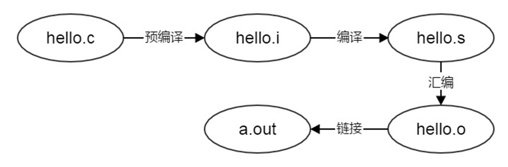
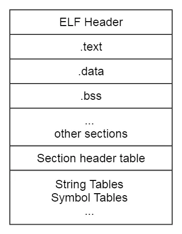

# 工具链哪些事
1. [背景](#background)
1. [简单的编译路径](#compile)
1. [工具链的工具](#usage)
1. [ld用法](#ld_usage)
1. [readelf用法](#readelf_usage)
1. [objdump用法](#objdump_usage)
1. [nm用法](#nm_usage)
## [背景](#TOCID)
> 1. 在 Linux 的编程中，通常使用 GNU 工具链编译 Bootloader、内核和应用程序。 GNU 组织维护了GCC、GDB、glibc、Binutils 等， 分 别 见 于 https://gcc.gnu.org/，https://www.gnu.org/software/gdb/, https://www.gnu.org/software/libc/、https://www.gnu.org/software/binutils/。
建立交叉工具链的过程相当繁琐，一般可以通过类似 crosstool-ng 这样的工具来做。
> 1. 当然，也可以直接下载第三方编译好的、开放的、针对目标处理器的交叉工具链，如
在 http://www.mentor.com/embedded-software/sourcery-tools/sourcery-codebench/editions/lite-edition/上可以下载针对ARM、MIPS、高通 Hexagon、Altera Nios II、Intel、AMD64 等处理器的工具链
> 1. 目前，在 ARM Linux 的开发中，人们趋向于使用 Linaro（http://www.linaro.org/）工具链团队维护的 ARM 工具链，它以每月一次的形式发布新的版本，编译好的可执行文件可从网址 http://www.linaro.org/downloads/ 下载。Linaro 是 ARM Linux 领域中最著名最具技术成就的开源组织，其会员包括 ARM、Broadcom、Samsung、TI、Qualcomm 等，国内的海思、中兴、全志和中国台湾的 MediaTek 也是它的会员。一个典型的 ARM Linux 工具链包含 arm-linux-gnueabihf-gcc（后续工具省略前缀）、strip、gcc、objdump、ld、gprof、nm、readelf、addr2line 等。
> 1. 其中，前缀中的“ hf”显示该工具链是完全的硬浮点，由于目前主流的 ARM 芯片都自带 VFP 或者 NEON 等浮点处理单元（FPU），所以对硬浮点的需求就更加强烈。Linux 的浮点处理可以采用完全软浮点，也可以采用与软浮点兼容，但是使用 FPU 硬件的 softfp，以及完全硬浮点。具体的 ABI（Application Binary Interface，应用程序二进制接口）通过-mfloat-abi= 参数指定，3 种情况下的参数分别是 -mfloat-abi=soft/softfp/hard。

## [简单的编译路径](#TOCID)

1. 编译器编译源代码后生成的文件叫做目标文件。在Linux下，使用gcc -c hello.c编译生成hello.o文件。
1. 目标文件的文件类型为ELF，在Linux下对应文件后缀为.o的文件，Window下对应文件后缀为.obj的文件。使用file命令可以查看到.o和.obj文件均为ELF类型。
1. 目标文件只是ELF文件的可重定位文件(Relocatable file)，ELF文件一共有4种类型：Relocatable file、Executable file、Shared object file和Core Dump file
1. 我们可以使用工具readelf 和objdump对目标文件simple.o进行分析。为了加深对目标文件的理解，在使用readelf & objdump进行前，需要先要了解ELF文件的结构。

## [工具链的工具](#TOCID)
1. strip 可以删除可执行文件中的符号表和调试信息等来实现缩减程序体积的目的。
1. gprof 在编译过程中在函数入口处插入计数器以收集每个函数的被调用情况和被调用次数，检查程序计数器并在分析时找出与程序计数器对应的函数来统计函数占用的时间。
1. objdump 是反汇编工具。nm 则用于显示关于对象文件、可执行文件以及对象文件库里的符号信息。
1. nm 则用于显示关于对象文件、可执行文件以及对象文件库里的符号信息。
1. Addr2line 工具（它是标准的 GNU Binutils 中的一部分）是一个可以将指令的地址和可执行映像转换成文件名、函数名和源代码行数的工具。
1. [readelf](#readelf_usage)命令，一般用于查看ELF格式的文件信息，常见的文件如在Linux上的可执行文件，动态库(*.so)或者静态库(*.a) 等包含ELF格式的文件。
1. [ld](#ld_usage)是一个链接程序工具，其作用主要是将汇编过的多个二进制文件进行链接，成为一个可执行的二进制文件，这个命令的选项有好多，具体用到的时候大家可以使用--help 选项来查看具体的选项用法。

## [ld用法](#TOCID)
> **下面将几个重要的命令介绍一下：**
-T File    --script FILE指定一个链接器脚本文件，指示编译器按照脚本进行链接；
-Tbss ADDRESS    bss段的链接地址；
-Ttext ADDRESS   代码段链接地址；
-Tdata ADDRESS  数据段链接地址；
-r --relocateable 产生可重定向的输出，比如，产生一个输出文件它可再次作为‘ld'的输入，这经常被叫做“部分链接”，当我们需要将几个小的.o文件链接成为一个.o文件的时候，需要使用此选项。
-e  指定程序的入口标号；
-l   LibName 指定要链接的库；
-L  Directory 增加库文件的搜索路径；
-o  FILE 设置输出文件名；
-O  输出文件最优；
-a  指定arch体系；
例如：
arm-linux-ld -Ttext 0x10000000 main.o -o main_elf
&emsp;&emsp;这句话是将main.o 文件连接成ELF格式文件，在连接的过程中，-Ttext 0x10000000这个选项告诉连接器我的这段main.o程序需要被加载到RAM的0x10000000地址处执行。所以在连接的时候main.o第一条语句的连接地址就是0x10000000，第二条语句就是跟在其后面。有很多人都议论连接地址和运行地址这个怎么说的都有。运行地址可以等于连接地址，还可以认为运行地址是pc指针指向的地址，就是正在执行指令的地址。

## [readelf用法](#TOCID)
> &emsp;&emsp;readelf命令用来显示一个或者多个elf格式的目标文件的信息，可以通过它的选项来控制显示哪些信息。这里的elf-file(s)就表示那些被检查的文件。可以支持32位，64位的elf格式文件，也支持包含elf文件的文档（这里一般指的是使用ar命令将一些elf文件打包之后生成的例如lib*.a之类的“静态库”文件）。 
&emsp;&emsp;这个程序和objdump提供的功能类似，但是它显示的信息更为具体，并且它不依赖BFD库(BFD库是一个GNU项目，它的目标就是希望通过一种统一的接口来处理不同的目标文件)，所以即使BFD库有什么bug存在的话也不会影响到readelf程序。 
&emsp;&emsp;运行readelf的时候，除了-v和-H之外，其它的选项必须有一个被指定。 
* **ELF文件类型**
	* 一共有4种类型：Relocatable file、Executable file、Shared object file和Core Dump file
	1. 可重定位文件:用户和其他目标文件一起创建可执行文件或者共享目标文件,例如lib*.a文件。 
	1. 可执行文件：用于生成进程映像，载入内存执行,例如编译好的可执行文件a.out。 
	1. 共享目标文件：用于和其他共享目标文件或者可重定位文件一起生成elf目标文件或者和执行文件一起创建进程映像，例如lib*.so文件。

* **ELF文件作用**
	* ELF文件参与程序的连接(建立一个程序)和程序的执行(运行一个程序)，所以可以从不同的角度来看待elf格式的文件： 
	1. 如果用于编译和链接（可重定位文件），则编译器和链接器将把elf文件看作是节头表描述的节的集合,程序头表可选。 
	1. 如果用于加载执行（可执行文件），则加载器则将把elf文件看作是程序头表描述的段的集合，一个段可能包含多个节，节头表可选。 
	1. 如果是共享文件，则两者都含有。 

* **ELF文件总体组成** 
	* elf文件头描述elf文件的总体信息。包括：系统相关，类型相关，加载相关，链接相关。 
	1. 系统相关表示：elf文件标识的魔术数，以及硬件和平台等相关信息，增加了elf文件的移植性,使交叉编译成为可能。 
	1. 类型相关就是前面说的那个类型。 
	1. 加载相关：包括程序头表相关信息。 
	1. 链接相关：节头表相关信息。 

* **readelf选项**
> -a 或 --all 显示全部信息,等价于 -h -l -S -s -r -d -V -A -I. 
-h 或 --file-header 显示elf文件开始的文件头信息. 
-l 或 --program-headers 或 --segments 显示程序头（段头）信息(如果有的话)。 
-S 或 --section-headers 或 --sections 显示节头信息(如果有的话)。 
-g 或 --section-groups 显示节组信息(如果有的话)。 
-t 或 --section-details 显示节的详细信息(-S的)。 
-s 或 --syms 或 --symbols 显示符号表段中的项（如果有的话）。 
-e 或 --headers 显示全部头信息，等价于: -h -l -S 
-n 或 --notes 显示note段（内核注释）的信息。 
-r 或 --relocs 显示可重定位段的信息。 
-u 或 --unwind 显示unwind段信息。当前只支持IA64 ELF的unwind段信息。 
-d 或 --dynamic 显示动态段的信息。 
-V 或 --version-info 显示版本段的信息。 
-A 或 --arch-specific 显示CPU构架信息。 
-D 或 --use-dynamic 使用动态段中的符号表显示符号，而不是使用符号段。 
-x <number or name> 或 --hex-dump=<number or name> 以16进制方式显示指定段内内容。number指定段表中段的索引,或字符串指定文件中的段名。 
-w[liaprmfFsoR] 或 --debug-dump[=line,=info,=abbrev,=pubnames,=aranges,=macro,=frames,=frames-interp,=str,=loc,=Ranges] 显示调试段中指定的内容。 
-I 或 --histogram 显示符号的时候，显示bucket list长度的柱状图。 
-v 或 --version 显示readelf的版本信息。 
-H 或 --help 显示readelf所支持的命令行选项。 
-W 或 --wide 宽行输出。 

## [objdump用法](#TOCID)
* **objdump选项**
> --archive-headers 或 -a 显示档案库的成员信息,类似ls -l将lib*.a的信息列出。 
-b bfdname 或 --target=bfdname 指定目标码格式。
这不是必须的，objdump能自动识别许多格式，比如： objdump -b oasys -m vax -h fu.o 显示fu.o的头部摘要信息，明确指出该文件是Vax系统下用Oasys编译器生成的目标文件。objdump -i将给出这里可以指定的目标码格式列表。 
-C 或 --demangle 将底层的符号名解码成用户级名字，除了去掉所开头的下划线之外，还使得C++函数名以可理解的方式显示出来。 
--debugging 或 -g 显示调试信息。企图解析保存在文件中的调试信息并以C语言的语法显示出来。仅仅支持某些类型的调试信息。有些其他的格式被readelf -w支持。 
-e 或 --debugging-tags 类似-g选项，但是生成的信息是和ctags工具相兼容的格式。 
--disassemble 或 -d 从objfile中反汇编那些特定指令机器码的section。 
-D 或 --disassemble-all 与 -d 类似，但反汇编所有section. 
--prefix-addresses 反汇编的时候，显示每一行的完整地址。这是一种比较老的反汇编格式。 
-EB 或 -EL 或 --endian={big|little} 指定目标文件的小端。这个项将影响反汇编出来的指令。在反汇编的文件没描述小端信息的时候用。例如S-records. 
-f 或 --file-headers 显示objfile中每个文件的整体头部摘要信息。 
-h 或 --section-headers 或 --headers 显示目标文件各个section的头部摘要信息。 
-H 或 --help 简短的帮助信息。 
-i 或 --info 显示对于 -b 或者 -m 选项可用的架构和目标格式列表。 
-j name 或 --section=name 仅仅显示指定名称为name的section的信息 
-l 或 --line-numbers 用文件名和行号标注相应的目标代码，仅仅和-d、-D或者-r一起使用使用-ld和使用-d的区别不是很大，在源码级调试的时候有用，要求编译时使用了-g之类的调试编译选项。 
-m machine 或 --architecture=machine 指定反汇编目标文件时使用的架构，当待反汇编文件本身没描述架构信息的时候(比如S-records)，这个选项很有用。可以用-i选项列出这里能够指定的架构. 
--reloc 或 -r 显示文件的重定位入口。如果和-d或者-D一起使用，重定位部分以反汇编后的格式显示出来。 
--dynamic-reloc 或 -R 显示文件的动态重定位入口，仅仅对于动态目标文件意义，比如某些共享库。 
-s 或 --full-contents 显示指定section的完整内容。默认所有的非空section都会被显示。 
-S 或 --source 尽可能反汇编出源代码，尤其当编译的时候指定了-g这种调试参数时，效果比较明显。隐含了-d参数。 
--show-raw-insn 反汇编的时候，显示每条汇编指令对应的机器码，如不指定--prefix-addresses，这将是缺省选项。 
--no-show-raw-insn 反汇编时，不显示汇编指令的机器码，如不指定--prefix-addresses，这将是缺省选项。 
--start-address=address 从指定地址开始显示数据，该选项影响-d、-r和-s选项的输出。 
--stop-address=address 显示数据直到指定地址为止，该项影响-d、-r和-s选项的输出。 
-t --syms 显示文件的符号表入口。类似于nm -s提供的信息 
-T --dynamic-syms 显示文件的动态符号表入口，仅仅对动态目标文件意义，比如某些共享库。它显示的信息类似于 nm -D|--dynamic 显示的信息。 
-V 或 --version 版本信息 
--all-headers 或 -x 显示所可用的头信息，包括符号表、重定位入口。-x 等价于-a -f -h -r -t 同时指定。 
-z 或 --disassemble-zeroes 一般反汇编输出将省略大块的零，该选项使得这些零块也被反汇编。 

## [nm用法](#TOCID)
* **nm用法**
	nm (选项) (参数)
* **nm选项**
> -A：每个符号前显示文件名；
-D：显示动态符号；
-g：仅显示外部符号；
-r：反序显示符号表。
* **nm参数**
	目标文件：二进制目标文件，通常是库文件和可执行文件。
