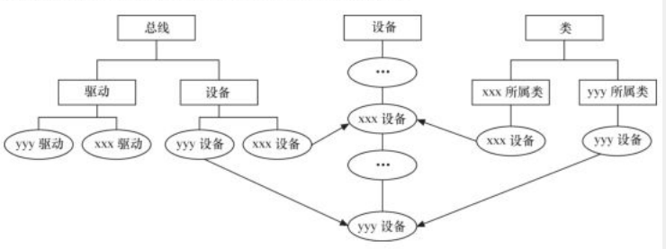

# Linux文件系统学习<span id="TOCID"></span>
1. [文件操作的系统调用](#sysapi)
1. [C库文件操作](#clibapi)
1. [linux文件系统的目录结构](#linuxtoc)
1. [linux文件系统与驱动](#fsdriver)
1. [devfs文件系统与驱动](#devfsdriver)
1. [sysfs文件系统和linux设备模型](#sysfsmode)
1. [udev的组成](#udevmakeof)
1. [udev规制文件](#udevrule)
1. [udev的组成](#udevmakeof)
1. [udev的组成](#udevmakeof)
## <span id="sysapi"></span>[文件操作的系统调用](#TOCID)
| 函数|说明|
|:-|:-|
| int creat(const char *filename, mode_t mode)|参数mode指定文件的权限，它和umask决定文件的最终权限(mode&umask)|
|int umask(int newmask)|umask代表需要去掉的一些权限|
|int open(const char *pathname, init flags)|pathname是要打开的文件(可包含路径,默认当前路径)，[flags标志](#flagtable),打开成功返回文件描述符|
|int open(const char *pathname, init flags, mode_t mode)|同上，[mode标志文件访问权限](#modetable)|
|int read(int fd, const void *buf, size_t length)|从文件描述符fd处，读取length字节到buf缓存中，返回值是实际读取字节|
|int write(int fd, const void *buf, size_t length)|把buf缓存区的length个字节写到文件描述符fd中，返回值是实际写入字节|
|int lseek(int fd, offset_t offset, int whence)|将文件读写指针相对[whence位置](#whencetable)移动offset个字节，操作成功，返回文件指针相对于文件头的位置。offset可取负值|
|int close(int fd)|关闭文件描述符，关闭文件|

|<span id="flagtable"></span>flags标志|含义|
|:-|:-|
|O_RDONLY|以只读方式打开文件|
|O_WRONLY|以只写方式打开文件|
|O_RDWR|以读写方式打开文件|
|O_APPEND|以追加方式打开文件|
|O_CREAT|创建一个文件|
|O_EXEC|如果使用了O_CREAT而且文件已经存在，就会报错|
|O_NOBLOCK|以非阻塞方式打开一个文件|
|O_TRUNC|如果文件存在，则删除文件内容|
**O_RDONLY、O_WRONLY、O_RDWR三个标志只能使用一个。如果使用O_CREAT标志，且调用int open(const char \*pathname, init flags, mode_t mode)的时候，必须指定mode标志来表示访问权限**
|<span id="modetable"></span>mode标志文件访问权限|含义|
|:-|:-|
|S_IRUSR|用户可读|
|S_IWUSR|用户可写|
|S_IXUSR|用户可执行|
|S_IRWXU|用户可读、写、执行|
|S_IRGRP|用户组可读|
|S_IWGRP|用户组可写|
|S_IXGRP|用户组可执行|
|S_IRWXG|用户组可读、写、执行|
|S_IROTH|其他人可读|
|S_IWOTH|其他人可写|
|S_IXOTH|其他人可执行|
|S_IRWXO|其他人可读、写、执行|
|S_ISUID|设置用户执行ID|
|S_IGUID|设置用户组执行ID|
**除了通过上述宏进行或逻辑来设置权限外，linux还可以用5个数字来表示文件的各种权限，其中权限由3bit组成，b001表示执行权限，b010表示写权限，b100表示读权限，**
|mode标志文件访问权限的5位数字|含义|
|:-|:-|
|第1位|设置用户ID|
|第2位|设置用户组ID|
|第3位|设置用户权限|
|第4位|设置用户组权限|
|第5位|设置其他人权限|
> open("test", O_CREAT, 10755)
等价于
open("test",O_CREAT, S_ISUID&nbsp; | &nbsp;S_IRWXU&nbsp; | &nbsp;S_IXOTH&nbsp; | &nbsp;S_IROTH)

|whence位置标记|含义|
|:-|:-|
|SEEK_SET|相对文件开头位置指针|
|SEEK_CUR|相对文件当前位置指针|
|SEEK_END|相对文件结束位置指针|
## <span id="clibapi"></span>[C库文件操作](#TOCID)
| 函数|说明|
|:-|:-|
|FILE* fopen(const char *path, const char *mode)|打开path(可包含文件，默认当前路径)文件，[modeC库标志位](#clibmode)|
|int fgetc(FILE *stream)|从stream文件中获取一个字节|
|int fputc(int c, FILE *stream)|把字节c写入stream文件中|
|char* fgets(char *s, FILE *stream)|从stream文件中获取一串数据到s数据区中|
|int fputs(const char *s, FILE *stream)|把s数据区的数据写入stream文件中|
|int fprintf(FILE *stream, const char *format, ...)|按照printf格式化字符串到stream文件中|
|int fscanf(FILE *stream, const char *format, ...)|按照printf格式化字符串获取stream文件中的内容|
|size_t fread(void *ptr, size_t size, size_t n, FILE *stream)|从stream中读取n个size字节块，并将读取的块放到ptr中|
|size_t fwrite(const void *ptr, size_t size, size_t n, FILE *stream)|从ptr数据区中把n个size字节块写入stream中|
|int fgetpos(FILE *stream, fpos_t *pos)|获取stream文件的位置到pos|
|int fsetpos(FILE \*stream, const fpos_t*pos)|按照pos设置stream文件的位置|
|int fseek(FILE *stream, long offset, int whence)|类似seek|
|long ftell(FILE *stream)|获取stream文件的当前位置|
|int rewind(FILE *stream)|把stream的文件指针放到开头|
|int fclose(FILE *stream)|关闭stream文件|

|<span id="clibmode"></span>modeC库标志位|含义|
|:-|:-|
|r、rb|以只读方式打开|
|w、wb|以只写方式打开。如果文件不存在，则创建该文件，否则文件被截断|
|a、ab|以追加方式打开。如果文件不存在，则创建改文件|
|r+、r+b、rb+|以读写方式打开|
|w+、w+b、wb+|以读写方式打开。如果文件不存在，创建新文件，否则文件被截断|
|a+、a+b+、ab+|以读和追加的方式打开。如果文件不存在，则创建文件|
**其中，b是区分二进制文件和文本文件，这一点在DOS和Windows系统中有区分，在linux不区分**
## <span id="linuxtoc"></span>[linux文件系统的目录结构](#TOCID)
|目录|描述|
|:-|:-|
|bin|包含基本命令，如ls、cp、mkdir等，这个目录都是可执行文件|
|sbin|包含系统命令，如modprobe、hwclock、ifconfig等，大多是设计系统管理命令的可执行文件|
|dev|设备文件的存储目录，应用程序通过对这些文件的读写和控制来访问实际设备|
|etc|系统配置文件的存储目录，一些服务器的配置文件也在这里，如用户账号密码文件等。busybox的启动脚本也在这|
|lib|系统库文件目录|
|mnt|一般用于存放存储设备的挂载目录，如cdrom等。可以参考/etc/fstab,又是我们可以把开机自动挂载的文件系统的挂载点放到这里|
|opt|可选目录，有些软件会安装在这里|
|proc|操作系统运行时，进程及内核信息(cpu、硬盘、内存等)存放这里。proc目录是伪系统目录，不是真正的文件系统，只存在于内存中|
|tmp|用户程序的临时文件目录|
|usr|系统存放程序的目录，比如用户命令、用户库等|
|var|这个目录的内容文件是经常变动的，如/var/log是系统日志|
|sys|linux2.6之后内核支持的sysfs文件系统被映射到这个目录。linux设备驱动的总线、驱动和设备都可以在sysfs文件系统中找到对应节点。当内核发现新节点时，会在sysfs文件系统生成一项新记录|
## <span id="fsdriver"></span>[linux文件系统与驱动](#TOCID)
1. 应用程序和VFS之间的接口是系统调用
1. VFS和文件系统已经设备文件之间的接口是file_operations结构体
1. file_operations结构体包含了对文件进行打开、关闭、读写和控制的一系列成员函数
	
1. 字符设备没有类似于ext2的文件系统，所以字符设备的file_operations结构体就直接有字符设备驱动提供了。
1. 块设备有两种访问方法，一是不通过文件系统直接访问块设备。在linux内核实现了统一的def_blk_fops这样的file_operations(源代码位于fs/block_dev.c)，所以当我们运行类似于`dd if=/dev/sdb1 of=sdb1.img`的命令的时候，把整个/dev/sdb1分区复制到sdb1.img时，内核就是用def_blk_fops这个file_operations。
1. 访问块设备的另外一种方法，通过文件系统来访问块设备，文件系统会把针对文件的对鞋转换为针对块设备原始删去的读写。ext2、fat、Btrfs等文件系统中会实现针对VFS的file_operations，设备驱动层看不到file_operations的存在。
	
1. file结构体
	file结构体代表一个打开的文件，每个打开的文件都有一个struct file，有内核打开文件时创建，并传递给相应的调用函数。在所有文件实例关闭后，内核释放这个数据结构。其代码中的是**数据指针private_data在设备驱动中被广泛运用，大多是指向驱动自定义的用于描述设备的结构体**
	
1. inode结构体
	&emsp;&emsp;VFS inode包含文件访问权限、属主、组、大小、生成时间、访问时间、最后修改时间等信息，它是linux管理文件系统的最基本单位，也是文件系统连接任何子目录、文件的桥梁。
	&emsp;&emsp;结构体中的i_rdev字段包含设备编号，i_rdev的高12位为主设备编号，低20位为次设备编号。可以通过imajor获取主设备编号，iminor获取次设备编号。
	查看/proc/devices文件可以获取系统中注册的设备，第一列为主设备号，第二列为设备名
	&emsp;&emsp;查看/dev目录可以获取当前系统包含的设备文件，日期前对应设备的主次编号
	&emsp;&emsp;主设备号代表哪一类性的驱动，次设备号代表同一类型驱动的不同设备序号，一般从0开始，内核Documents目录下的devices.txt描述linux设备号的分配情况，它由LANANA([the Linux Assigned Names and Numbers authority](http://www.lanana.org)维护)。Torben Mathiasen(device@lanana.org)是主要的维护者
## <span id="devfsdriver"></span>[devfs文件系统与驱动](#TOCID)
&emsp;&emsp;devfs文件系统是在linux2.4内核引入的，引入时被许多工程师给予好评，它的出现使得设备驱动程序能自主地管理自己的设备文件，具有以下优点：
	1. 在设备初始化时，在/dev目录下创建设备文件，卸载设备时将它删除。
	1. 设备驱动程序可以指定设备名、所有者和权限，在用户空间也可以修改所有者和权限。
	1.不再需要为设备分配主次设备号，在程序中可以传递0设备号来调用register_chrdev来获取可用的主设备号，并在devfs_register()中指定次设备号。
```
devfs_handle_t devfs_mk_dir(devfs_handle_t dir, const char *name, void *info)//创建设备目录
devfs_handle_t devfs_register(devfs_handle_t dir, const char *name, unsigned int flags, unsigned int major, unsigned int minor, umode_t mode, void *ops, void *info)//创建设备文件
void devfs_unregister(devfs_handle_t de)//销毁设备文件
```

## <span id="udev"></span>[udev用户空间设备管理](#TOCID)
1. udev和devfs的区别
	&emsp;&emsp;尽管devfs有很多优点，但是在linux2.6内核中，devfs被认为是过时的，并最终被udev取代。下面是udev取代devfs的几点原因：
	1. devfs所做的工作，可以在用户态里面实现。
	1. 发现devfs有一些无法修复的bug
	1. devfs的开发者和维护者开始已经停止对代码的维护
	1. udev完全工作在用户态，并利用设备的加入或移除向内核发送热拔插事件。在热拔插时，设备的详细信息会由内核通过netlink套接字发送出来，发出的时间叫uevent。
	1. udev设备命名的策略、控制权限和事件处理都是在用户态完成的，它利用内核发出的信息进行创建设备文件节点等工作。
	
	
	编译上述程序，并把apple facetime hd camera usb摄像头插入Ubuntu，该程序dump类似下面的信息：
	
	udev采用这种netlink的方式接收信息，并根据用户给udev设置的规则做匹配进行工作。
	1. udev在冷拔插的时候，linux内核在sysfs提供一个uevent的节点，可以往该节点写一个“add”，使内核重新发送netlink，之后udev就可以收到冷拔插的netlink信息。还是如上代码，当我们手动往/sys/module/psmouse/uevent写一个“add”的时候就会有：
	
	1. devfs和udev最大的区别在于，在devfs中，当一个不存在的/dev节点被打开的时候，devfs会自动加载驱动，而udev则是在设备被发现的时候加载驱动模块。
## <span id="sysfsmode"></span>[sysfs文件系统和linux设备模型](#TOCID)
&emsp;&emsp;linux2.6以后的内核引入了sysfs文件系统，sysfs被认为是和proc、devfs、devpty同类别的文件系统，该文件系统是虚拟的文件系统，可以看成是一个所有系统硬件的层级视图，与提供进程和状态信息的proc文件系统十分类似。sysfs把连接在系统上的设备和总线组织成一个分级的文件系统，并可以由用户空间存取、向用户空间导出内核数据结构以及他们的属性，sysfs一般包括下面的文件目录
|目录|描述|
|:-|:-|
|block|块设备目录，目前此目录已指向到/sys/devices/中设备描述符链接文件|
|bus|备按总线类型分层放置子目录，/sys/devices/中的所有设备都是链接于某种总线，bus子目录在每一种具体总线之下都可以找到对应每一个具体设备的描述符号链接|
|class|设备按功能分类放置子目录|
|dev|按字符设备和块设备的主次号码分类放置子目录，根据主次号码链接到真实设备（/sys/devices/）的设备描述符链接文件|
|devices|所有设备的基本总线分类子目录，保存了系统的所有设备，是/sys文件系统管理设备的最重要目录|
|firmware|系统加载固件的用户空间接口|
|fs|系统中所有的文件系统，包括文件系统本身和按文件系统分类存放的已挂载点，目前只有duse,gfs2等少数文件系统支持sysfs接口，一些传统的虚拟文件系统VFS层次控制参数仍然在sysctl（/proc/sys/kernel）中|
|kernel|内核所有可调整参数子目录，目前只有较新的设计在此目录中，其他内核可调整参数仍在sysctl(/proc/sys/kernel)中|
|module|模块信息，编译为外部模块（.ko文件）时，加载后在目录/sys/module/<module name>中，并且这个目录下有属性文件和属性目录来表示此外部模块的信息|
|power|系统电源选项，修改此目录的属性文件可以控制机器的电源状态|
|slab (对应 2.6.23 内核，在 2.6.24 以后移至 /sys/kernel/slab)|从2.6.23 开始可以选择 SLAB 内存分配器的实现，并且新的 SLUB（Unqueued Slab Allocator）被设置为缺省值；如果编译了此选项，在 /sys 下就会出现 /sys/slab ，里面有每一个 kmem_cache 结构体的可调整参数。对应于旧的 SLAB 内存分配器下的 /proc/slabinfo 动态调整接口，新式的 /sys/kernel/slab/<slab_name> 接口中的各项信息和可调整项显得更为清晰。|


**在linux内核中，设备和驱动是分开注册的，注册一个设备的时候，并不需要驱动已经存在，而注册一个驱动的时候，也不需要一个设备已经存在。设备和驱动各自涌向内核，每个设备和驱动涌入内核的时候，都会去寻找另一半，他们通过bus_type的match()函数捆绑起来**
**总线(bus_type)、驱动(device_type)和设备(device)最终都会落实为sysfs的一个目录，从代码可以发现，它们实际都是从kobject派生而来，kobject可以看成是所有总线(bus_type)、设备(device)和驱动(device_type)的抽象基类，1个kobject对应一个目录**
## <span id="udevmakeof"></span>[udev的组成](#TOCID)
&emsp;&emsp;udev和systemd项目合并，可见于http://lwn.net/Articles/490413的文档《Udev and systemd to merge》，可从http://cgit.freedesktop.org/systemd、https://github.com/systemd/systemd等位置下载最新代码。
&emsp;&emsp;udev在用户空间执行，动态的建立和删除设备文件，允许每个开发者不关心主次设备号而提供LSB(linux标准规范，linux standard base)名称，并且可以根据需要固定名称，udev工作流程：
	1. 当内核发现新设备后，内核通过netlink发送uevent
	1. udev获取内核发出的信息，进行规制匹配（匹配的内容包括：SUBSYSTEM、ACTION、attribute、内核提供的名称（KERNEL=）以及其他的环境变量）。
	1. 假设我们再linux系统插上一个Kingston的U盘，我们可以通过udev工具`udevadmionitou --kernel --property --udev`捕获uevent信息如下：
	
	我们可以通过下面的代码让，插入kingstonU盘的时候自动为它创建一个/dev/kingstonUD的符号链接
	```
	#Kingston USB mass storage
	SUBSYSTEM=="block",ACTION=="add",KERNEL=="*sd?",ENV{ID_TYPE}=="disk",ENV{ID_VENDOR}=="Kingston",ENV{ID_USB_DRIVER}=="usb-storage",SYMLINK+="kingstonUD"
	```
## <span id="udevrule"></span>[udev规制文件](#TOCID)
&emsp;&emsp;udev 规则是定义在一个以 .rules 为扩展名的文件中。那些文件主要放在两个位置：/usr/lib/udev/rules.d，这个目录用于存放系统安装的规则；/etc/udev/rules.d/ 这个目录是保留给自定义规则的。定义那些规则的文件的命名惯例是使用一个数字作为前缀（比如，50-udev-default.rules），并且以它们在目录中的词汇顺序进行处理的。在 /etc/udev/rules.d 中安装的文件，会覆盖安装在系统默认路径中的同名文件。
&emsp;&emsp;udev的规则文件是以行为单位，以"#"开头的表示注释，其余每一行代表一个规则，每个规则分一个或多个匹配部分和赋值部分，匹配部分用匹配专用关键字来表示，赋值部分用赋值专用部分来表示。
&emsp;&emsp;udev的规则匹配，可以通过"*"代替任意字符、"?"代替一个字符、"[a~c]" 匹配一个a到c的字符、"[1~9]"匹配一个1到9的数字等shell通配符来灵活匹配。此外，%k代表KERNEL、%n代表设备KERNEL序号(如存储设备的分区号)
**使用udevadm info工具查找规则信息**
**`udevadm info -a -p /sys/devices/platform/serial8250/tty/ttyS0`获取tty信息**
**`udevadm info -a -p $(udevadm info -q path -n /dev/<节点名>)`反向分析信息**
|匹配键|描述|
|:-|:-|
|ACTION|事件(uevent)的行为，例如：add(添加设备)、remove(删除设备)。|
|KERNEL|内核设备名称，例如：sda, cdrom|
|ATTR|设备属性|
|NAME|创建设备的文件名|
|SYMLINK|设备的符号链接名|
|OWNER|设备所有者|
|GROUP|设备所属组|
|MODE|节点访问权限|
|DEVPATH|设备的 devpath 路径|
|SUBSYSTEM|设备的子系统名称，例如：sda 的子系统为 block|
|BUS|设备在 devpath 里的总线名称，例如：usb|
|DRIVER|设备在 devpath 里的设备驱动名称，例如：ide-cdrom|
|ID|设备在 devpath 里的识别号|
|SYSFS{filename}|设备的 devpath 路径下，设备的属性文件“filename”里的内容,YSFS{model}==“ST936701SS”表示：如果设备的型号为 ST936701SS|
|ENV{key}|环境变量。在一条规则中，可以设定最多五条环境变量的 匹配键|
|IMPORT|调用外部程序|
|PROGRAM|调用外部命令,PROGRAM=="/lib/udev/scsi_id -g -s $devpath"|
|RESULT|外部命令 PROGRAM 的返回结果,RESULT=="35000c50000a7ef67"|