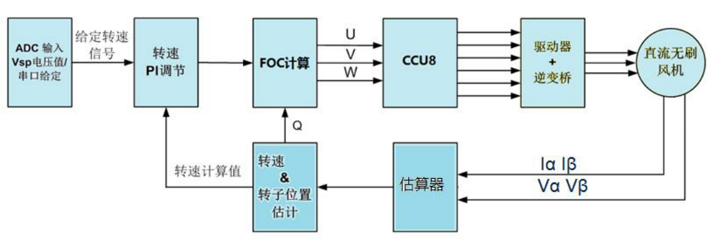
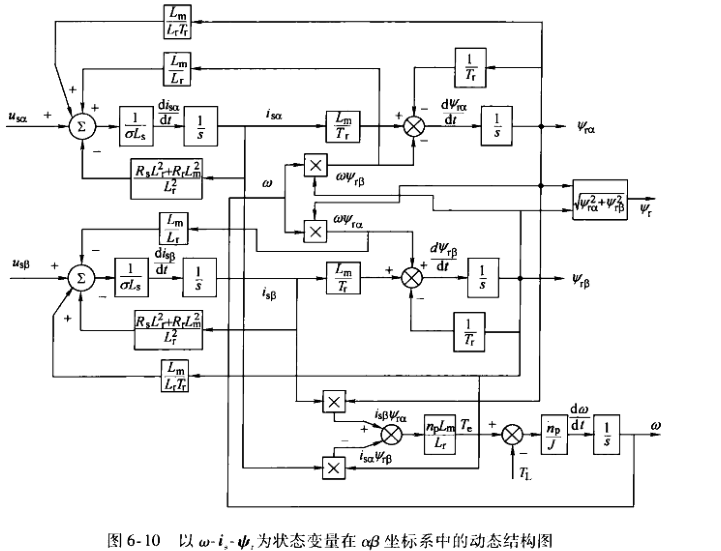

# bldc学习
可参考书籍《电力拖动自动控制系统-运动控制系统》
1. [FOC框图](#foc)
1. [IQ库学习](#iqmathlib)
2. [电流采样](#cursample)
2. [坐标变换](#coordinate)
   1. [定子坐标系变换](#Clarke)
   1. [转子子坐标系变换](#Park)
   1. [定向坐标系变换](#Clarke)
4. [矢量合成学习(SVPWM)](#svpwm)
   1. [合成矢量控制原理](#controlbase)
   2. [磁链矢量扇区判断](#sector)
   3. [SVPWM主要控制方式分类](#svpwmcontrol)
   4. [SVPWM的时间控制](#svpwmtime)
5. [位置估算](#position)
   1. [位置方程](#posifun)
   2. [反正切法-位置估算](#arctan)
   3. [PLL锁相环法-位置估算](#PLL)
3. [坐标变换对应的参数方程](#equation)
   1. [坐标系原始方程](#origin)
   1. [变换到静止坐标系方程](#static)
   1. [变换到旋转坐标系方程](#spin)
3. [正交坐标系的状态方程](#status)
   1. [以速度\定子电流\转子磁通为输入量的状态方程](#wipstatus)
   2. [以速度\定子电流\定子磁通为输入量的状态方程](#wip1status)
## [FOC框图](#TOCID)

FOC总框图

无感FOC框图

## [IQ库学习](#TOCID)
1. [IQ库英文文档](pic/04IQ_math_lib.pdf),文件路径：pic/04IQ_math_lib.pdf
1. [IQ库中文文档](pic/04IQmath中文手册.pdf),文件路径：pic/04IQmath中文手册.pdf
1. [Sin_Table](https://www.mymathtables.com/trigonometric/cotangents-0to90-tables.html),文件路径：https://www.mymathtables.com/trigonometric/cotangents-0to90-tables.html
## [电流采样](#TOCID)
1. 电流采样
	> 电流采样实则是指，当桥臂导通时相应通过的相电流，由于三相电流代数和为0，所以我们仅采样其中两项电流，第三相电流通过代数和为0反推出来。
	> 同时由于采样的功率电阻不大（图为0.15欧）,通过的电流就算1A电压也不大，所以需要通过运放进行电压放大，放大后接入单片机的AD采样口，
	> 换算公式可以如$\frac{5V}{(0.15Ω * xA * M倍)} * 4096(采样精度12位)$
	
1. AD校正偏差
	> 由于电路本身的差异性，我们需要在上电前到电压稳定后先进行AD采样，作为初始的偏移AD值 
1. 电流代数计算
   设： 采样电阻为R， 放大倍数为A， 精度为12位4096， 电压V为5000mV， 采样的值是d
   $i_a = \frac{5000ARd_a}{4096},i_b = \frac{5000ARd_b}{4096},i_c=-i_a-i_b$
1. 电流采样方式
	1. 单电阻采样
	* 单电阻采样：通过母线电流，实现一个周期内两相电流的先后采样，通过三相电流代数和为0，算出第三相电流。(**对AD采样要求高，PWM控制精度高**)
	
	

	1. 双电阻采样
	* 双电阻采样：通过对桥臂电流采样实现，一个周期两相电流的同时采样，通过电流代数和为0，换算出第三相电流。
	

## [坐标变换](#TOCID)
***转子磁场的定向控制是指：控制逆变输出使得q-d坐标系和M-T坐标系重合***
1. 定子坐标系变换(Clarke变换)
	* **定子坐标系变换(Clarke变换)是指: 把三相定子绕组A-B-C(每相相差120°)坐标系转换为$\alpha-\beta$坐标系**
	* **$\alpha-\beta$坐标系($\alpha$轴与A轴重合，$\beta$轴超前$\alpha$轴90°)**
	
	> 设：三相电绕组的匝数为$N_3$,两相绕组有效匝数为$N_2$
	> $$N_2i_{\alpha}=N_3i_A-N_3i_Bcos\frac{\pi}{3}-N_3i_Ccos\frac{\pi}{3}=N_3(i_A-\frac{i_B}{2}-\frac{i_C}{2}) \tag{1}$$ 
	> $$N_2i_{\beta}=N_3i_Bsin\frac{\pi}{3}-N_3i_Csin\frac{\pi}{3}=\frac{\sqrt{3}}{2}N_2(i_B-i_C) \tag{2}$$
	> $$i_A+i_B+i_C=0  \tag{3}$$
	由式(1)(2)和$\frac{\sqrt{2}}{2}$(3)(**取$\frac{\sqrt{2}}{2}$是因为刚好使得矩阵成为正交矩阵**)可得
	> $$ \left[ \begin{matrix} i_{\alpha} \\i_{\beta} \\0\end{matrix} \right] = \frac{N_3}{N_2} \left[ \begin{matrix} 1 & -\frac{1}{2} & -\frac{1}{2} \\0 & \frac{\sqrt{3}}{2} & -\frac{\sqrt{3}}{2} \\\frac{\sqrt{2}}{2} & \frac{\sqrt{2}}{2} & \frac{\sqrt{2}}{2} \end{matrix} \right] \left[ \begin{matrix} i_A \\i_B \\i_C\end{matrix} \right] \tag{4} $$
	由于变换前后总功率不变，因而$\frac{N_3}{N_2} = \sqrt{\frac{2}{3}}$,整理后可得**Clarke变换**：
	> $$ \left[ \begin{matrix} i_{\alpha} \\i_{\beta} \end{matrix} \right] =  \left[ \begin{matrix} \sqrt{\frac{3}{2}} & 0\\\sqrt{\frac{1}{2}} & \sqrt{2} \end{matrix} \right] \left[ \begin{matrix} i_A \\i_B\end{matrix} \right] \tag{5} $$
	矩阵(5)对应的逆变换(**Clarke逆变换**)为：
	> $$ \left[ \begin{matrix} i_A \\i_B\end{matrix} \right] =  \left[ \begin{matrix} \sqrt{\frac{2}{3}} & 0\\-\sqrt{\frac{1}{6}} & \sqrt{\frac{1}{2}} \end{matrix} \right] \left[ \begin{matrix} i_{\alpha} \\i_{\beta} \end{matrix} \right] \tag{6} $$
	***类似于电流变换，电压变换和磁通变换也可以相应的变换***

2. 转子坐标系变换(Park变换)
	* **转子坐标系变换(Park变换)是指: 把静止定子坐标系$\alpha-\beta$坐标系转换为旋转的转子坐标系d-q坐标系**
	* **d-q坐标系(d轴与转子磁极的轴线重合，q轴超前d轴90°)(d-q坐标系和转子同步旋转)**

	> 由图可知：
	> $$i_{d} = i_{\alpha}cos\varphi + i_{\beta}sin\varphi \tag{1}$$
	> $$i_{q} = -i_{\alpha}sin\varphi + i_{\beta}cos\varphi \tag{2}$$
	写成矩阵(**Park变换**)形式，如下：
	> $$ \left[ \begin{matrix} i_d \\i_q\end{matrix} \right] =  \left[ \begin{matrix} cos\varphi & sin\varphi\\-sin\varphi & cos\varphi \end{matrix} \right] \left[ \begin{matrix} i_{\alpha} \\i_{\beta} \end{matrix} \right] \tag{3} $$
	其对应的逆变换(**Park逆变换**)：
	> $$\left[ \begin{matrix} i_{\alpha} \\i_{\beta} \end{matrix} \right]  =  \left[ \begin{matrix} cos\varphi & -sin\varphi\\sin\varphi & cos\varphi \end{matrix} \right] \left[ \begin{matrix} i_d \\i_q\end{matrix} \right] \tag{4} $$
	***类似于电流变换，电压变换和磁通变换也可以相应的变换***

1. 定向坐标系变换
	* **定向坐标系变换是指: 把旋转的转子坐标系d-q坐标系同步为定向坐标系M-T坐标系**
	* **M-T坐标系(M(d)轴与磁链方向重合，T(q)轴是超前M(d)轴90°的力矩轴)**
	* **转子磁场的定向控制时，M-T坐标系与d-q坐标重合**

## [矢量合成学习(SVPWM)](#TOCID)
1. 合成矢量控制原理
	设中性点为O，逆变器(我们代码控制)输出的三相相电压为$U_{AO},U_{BO},U_{CO}$,他们在空间上相差120°，因而可以定义三个电压矢量为$U_{AO}(t),U_{BO}(t),U_{CO}(t)$,(**实际上这是我们控制6个mos关开关的结果**)
	
	
	按照空间矢量功率与三相瞬时功率不变的原则得：$k=\sqrt{\frac{2}{3}}且\gamma=\frac{2\pi}{3}$
	> 设$U_d$为相电压的有效值，f为电源频率则有：
	> $$\left\{\begin{aligned}
		\theta  = & 2{\pi}ft \\
		U_{AO}(t)  = & U_d\cos(\theta) \\
		U_{BO}(t)  = & U_d\cos(\theta - \frac{2\pi}{3}) \\
		U_{CO}(t)  = & U_d\cos(\theta - \frac{4\pi}{3}) 
		\end{aligned}\right.$$
	> 设$u_s$为三相电压合成的电压空间矢量，则有：
	> $$U_s(t) = \sqrt{\frac{2}{3}}[U_{AO}(t) + U_{BO}(t)e^{j\frac{2\pi}{3}} + U_{CO}(t)e^{j\frac{4\pi}{3}}]=\sqrt{\frac{2}{3}}U_de^{j\theta} \tag{1}$$
	> 这里的[$U_de^{j\theta}$](https://www.zhihu.com/question/41134540)代表的是把矢量$U_d$旋转$\theta$度角，具体可以参考链接：https://www.zhihu.com/question/41134540。 因而合成的矢量$U_s(t)$是一个旋转的空间矢量.
	> 设直流地为O',则可证明合成电压矢量和参考点无关
	> $$\left\{\begin{aligned}
		 U_s(t) = & \sqrt{\frac{2}{3}}[U_{AO}(t) + U_{BO}(t)e^{j\frac{2\pi}{3}} + U_{CO}(t)e^{j\frac{4\pi}{3}}]\\
		 = &\sqrt{\frac{2}{3}}[(U_{AO'}(t) - U_{OO'}(t)) \\
		 &+ (U_{BO'}(t)e^{j\frac{2\pi}{3}} - U_{OO'}(t)e^{j\frac{2\pi}{3}})\\
		 &+ (U_{CO'}(t)e^{j\frac{4\pi}{3}} - U_{OO'}(t)e^{j\frac{4\pi}{3}})]\\
		 =& \sqrt{\frac{2}{3}}[U_{AO'}(t) + U_{BO'}(t)e^{j\frac{2\pi}{3}} + U_{CO'}(t)e^{j\frac{4\pi}{3}}\\
		 -& U_{OO'}(t))(1+e^{j\frac{2\pi}{3}}+e^{j\frac{4\pi}{3}})]\\
		  =& \sqrt{\frac{2}{3}}[U_{AO'}(t) + U_{BO'}(t)e^{j\frac{2\pi}{3}} + U_{CO'}(t)e^{j\frac{4\pi}{3}}]
		\end{aligned}\right.$$
	**这里的$U_{AO'}(t),U_{BO'}(t),U_{CO'}(t)$是以直流地为参考的电压,因此我们可以任意定义参考点**

	
	**通过等效模型可以简单的换算出各个矢量的表示**
	> 以$u_0(1,0,0)$为例，
	A的上桥臂导通，下桥臂截止。
	B的上桥臂截止，下桥臂导通。
	C的上桥臂截止，下桥臂导通。
	
	$$\left\{\begin{aligned}
		&U_{ab} = U_d, U_{bc} = 0, U_{ca} = -U_d\\
		&U_{ao} - U_{bo} = U_d, U_{ao} - U_{co} = U_d\\
		&U_{ao} + U_{bo} + U_{co} = 0 
		\end{aligned}\right. $$
	> 解得：$U_{ao} = \frac{2}{3}U_d, U_{bo} = -\frac{1}{3}U_d, U_{co} = -\frac{1}{3}U_d$
	> 把结果代入合成的电压空间矢量(1)式得：
	$$U_s(t) = \sqrt{\frac{2}{3}}[\frac{2}{3}U_d - \frac{1}{3}U_de^{j\frac{2\pi}{3}} - \frac{1}{3}U_de^{j\frac{4\pi}{3}}]=\sqrt{\frac{2}{3}}U_d $$

	| 电压|开关SA|开关SB|开关SC|UA|UB|UC|合成US|
	|:-|:-|:-|:-|:-|:-|:-|:-|:-|
	| $u_0$|0|0|0|0|0|0|0|
	| $u_1$|1|0|0|$\frac{2}{3}U_d$|$-\frac{1}{3}U_d$|$-\frac{1}{3}U_d$|$\sqrt{\frac{2}{3}}U_d$|
	| $u_2$|1|1|0|$\frac{1}{3}U_d$|$\frac{1}{3}U_d$|$-\frac{2}{3}U_d$|$\sqrt{\frac{2}{3}}U_de^{j\frac{\pi}{3}}$|
	| $u_3$|0|1|0|$-\frac{1}{3}U_d$|$-\frac{1}{3}U_d$|$-\frac{1}{3}U_d$|$\sqrt{\frac{2}{3}}U_de^{j\frac{2\pi}{3}}$|
	| $u_4$|0|1|1|$-\frac{1}{3}U_d$|$\frac{1}{3}U_d$|$\frac{1}{3}U_d$|$\sqrt{\frac{2}{3}}U_de^{j\frac{3\pi}{3}}$|
	| $u_5$|0|0|1|$-\frac{1}{3}U_d$|$-\frac{1}{3}U_d$|$\frac{2}{3}U_d$|$\sqrt{\frac{2}{3}}U_de^{j\frac{4\pi}{3}}$|
	| $u_6$|1|0|1|$\frac{1}{3}U_d$|$-\frac{2}{3}U_d$|$\frac{1}{3}U_d$|$\sqrt{\frac{2}{3}}U_de^{j\frac{5\pi}{3}}$|
	| $u_7$|1|1|1|0|0|0|0|
	
	
	图3.png)
	

2. 磁链矢量扇区判断
	| 扇区号|落在该扇区条件|变化成条件|$\alpha$条件|$\beta$条件|
	|:-|:-|:-|:-|:-|
	| 扇区1|由$0°<\arctan{\frac{U_{\beta}}{U_{\alpha}}} <60°$， 得$U_{\alpha}>0$ ，$U_{\beta}>0$ 且 $\frac{U_{\beta}}{U_{\alpha}}<\sqrt{3}$ |$U_{\alpha}>0$  $U_{\beta}>0$ $\frac{\sqrt{3}}{2}U_{\alpha}-\frac{1}{2}U_{\beta}>0$|$U_{\beta}>0$ $\frac{\sqrt{3}}{2}U_{\alpha}+\frac{1}{2}U_{\beta}>0$ $\frac{\sqrt{3}}{2}U_{\alpha}-\frac{1}{2}U_{\beta}>0$|$U_{\beta}>0$ $\frac{\sqrt{3}}{2}U_{\alpha}+\frac{1}{2}U_{\beta}>0$ $(\frac{\sqrt{3}}{2}U_{\alpha}+\frac{1}{2}U_{\beta})-U_{\beta})>0$|
	| 扇区2|由$60°<\arctan{\frac{U_{\beta}}{U_{\alpha}}} <120°$， 得$U_{\beta}>0$ 且 $\frac{U_{\beta}}{\|U_{\alpha}\|}>\sqrt{3}$|$U_{\beta}>0$ $\frac{\sqrt{3}}{2}U_{\alpha}-\frac{1}{2}U_{\beta}<0$ $\frac{\sqrt{3}}{2}U_{\alpha}+\frac{1}{2}U_{\beta}>0$|$U_{\beta}>0$ $\frac{\sqrt{3}}{2}U_{\alpha}+\frac{1}{2}U_{\beta}>0$ $\frac{\sqrt{3}}{2}U_{\alpha}-\frac{1}{2}U_{\beta}<0$|$U_{\beta}>0$ $\frac{\sqrt{3}}{2}U_{\alpha}+\frac{1}{2}U_{\beta}>0$ $(\frac{\sqrt{3}}{2}U_{\alpha}+\frac{1}{2}U_{\beta})-U_{\beta})<0$|
	| 扇区3|由$120°<\arctan{\frac{U_{\beta}}{U_{\alpha}}} <180°$， 得$U_{\alpha}<0$ ，$U_{\beta}>0$ 且 $\frac{U_{\beta}}{-U_{\alpha}}<\sqrt{3}$|$U_{\alpha}<0$ $U_{\beta}>0$ $\frac{\sqrt{3}}{2}U_{\alpha}+\frac{1}{2}U_{\beta}<0$|$U_{\beta}>0$ $\frac{\sqrt{3}}{2}U_{\alpha}+\frac{1}{2}U_{\beta}<0$ $\frac{\sqrt{3}}{2}U_{\alpha}-\frac{1}{2}U_{\beta}<0$|$U_{\beta}>0$ $\frac{\sqrt{3}}{2}U_{\alpha}+\frac{1}{2}U_{\beta}<0$ $(\frac{\sqrt{3}}{2}U_{\alpha}+\frac{1}{2}U_{\beta})-U_{\beta})<0$|
	| 扇区4|由$180°<\arctan{\frac{U_{\beta}}{U_{\alpha}}} <240°$， 得$U_{\alpha}<0$ ，$U_{\beta}<0$ 且 $\frac{-U_{\beta}}{-U_{\alpha}}<\sqrt{3}$|$U_{\alpha}<0$ $U_{\beta}<0$ $\frac{\sqrt{3}}{2}U_{\alpha}-\frac{1}{2}U_{\beta}<0$|$U_{\beta}<0$ $\frac{\sqrt{3}}{2}U_{\alpha}+\frac{1}{2}U_{\beta}<0$ $\frac{\sqrt{3}}{2}U_{\alpha}-\frac{1}{2}U_{\beta}<0$|$U_{\beta}<0$ $\frac{\sqrt{3}}{2}U_{\alpha}+\frac{1}{2}U_{\beta}<0$ $(\frac{\sqrt{3}}{2}U_{\alpha}+\frac{1}{2}U_{\beta})-U_{\beta})<0$|
	| 扇区5|由$240°<\arctan{\frac{U_{\beta}}{U_{\alpha}}} <300°$， 得$U_{\beta}<0$ 且 $\frac{-U_{\beta}}{\|U_{\alpha}\|}>\sqrt{3}$|$U_{\beta}<0$ $\frac{\sqrt{3}}{2}U_{\alpha}-\frac{1}{2}U_{\beta}>0$ $\frac{\sqrt{3}}{2}U_{\alpha}+\frac{1}{2}U_{\beta}<0$|$U_{\beta}<0$ $\frac{\sqrt{3}}{2}U_{\alpha}+\frac{1}{2}U_{\beta}<0$ $\frac{\sqrt{3}}{2}U_{\alpha}-\frac{1}{2}U_{\beta}>0$|$U_{\beta}<0$ $\frac{\sqrt{3}}{2}U_{\alpha}+\frac{1}{2}U_{\beta}<0$ $(\frac{\sqrt{3}}{2}U_{\alpha}+\frac{1}{2}U_{\beta})-U_{\beta})>0$|
	| 扇区6|由$300°<\arctan{\frac{U_{\beta}}{U_{\alpha}}} <360°$， 得$U_{\alpha}>0$ ，$U_{\beta}<0$ 且 $\frac{-U_{\beta}}{U_{\alpha}}<\sqrt{3}$|$U_{\alpha}>0$  $U_{\beta}<0$ $\frac{\sqrt{3}}{2}U_{\alpha}+\frac{1}{2}U_{\beta}>0$|$U_{\beta}<0$ $\frac{\sqrt{3}}{2}U_{\alpha}+\frac{1}{2}U_{\beta}>0$ $\frac{\sqrt{3}}{2}U_{\alpha}-\frac{1}{2}U_{\beta}>0$|$U_{\beta}<0$ $\frac{\sqrt{3}}{2}U_{\alpha}+\frac{1}{2}U_{\beta}>0$ $(\frac{\sqrt{3}}{2}U_{\alpha}+\frac{1}{2}U_{\beta})-U_{\beta})>0$|

	| $U_{\beta}>0$|$\frac{\sqrt{3}}{2}U_{\alpha}+\frac{1}{2}U_{\beta}>0$|$\frac{\sqrt{3}}{2}U_{\alpha}-\frac{1}{2}U_{\beta}>0$ $(\frac{\sqrt{3}}{2}U_{\alpha}+\frac{1}{2}U_{\beta})-U_{\beta}>0$|$\alpha$条件扇区号 $\beta$条件扇区号|
	|:-:|:-:|:-:|:-:|
	| A|B|C|N|
	| 1|1|1|扇区1|
	| 1|1|0|扇区2|
	| 1|0|0|扇区3|
	| 0|0|0|扇区4|
	| 0|0|1|扇区5|
	| 0|1|1|扇区6|
	若把ABC的值按照3bit进行分配，则可以做如下等式判断$\alpha$条件$N=4C+2B+A$
	| $\alpha$条件扇区|1|2|3|4|5|6|
	|:-:|:-:|:-:|:-:|:-:|:-:|:-:|
	| N|7|3|1|0|4|6|
	若把按照代码进行分析则可以做如下等式判断
	1. X = $U_{\beta}$
	2. Y = $\frac{\sqrt{3}}{2}U_{\alpha}+\frac{1}{2}U_{\beta}$
	3. Z = X - Y = $-\frac{\sqrt{3}}{2}U_{\alpha}+\frac{1}{2}U_{\beta}$
	4. v->angle = (X > 0) + ((Y > X)<<1) + ((Z > X)<<2)
   
	| $U_{\beta}>0$|$\frac{\sqrt{3}}{2}U_{\alpha}+\frac{1}{2}U_{\beta}>U_{\beta}$ $\frac{\sqrt{3}}{2}U_{\alpha}-\frac{1}{2}U_{\beta}>0$|$-\frac{\sqrt{3}}{2}U_{\alpha}+\frac{1}{2}U_{\beta}>U_{\beta}$ $\frac{\sqrt{3}}{2}U_{\alpha}+\frac{1}{2}U_{\beta}<0$|代码扇区号|
	|:-:|:-:|:-:|:-:|
	| A|B|C|N|
	| 1|1|0|扇区1|
	| 1|0|0|扇区2|
	| 1|0|1|扇区3|
	| 0|0|1|扇区4|
	| 0|1|1|扇区5|
	| 0|1|0|扇区6|
	若把ABC的值按照3bit进行分配，则可以做如下等式判断$\beta$条件$N=4C+2B+A$
	| 代码条件扇区|1|2|3|4|5|6|
	|:-:|:-:|:-:|:-:|:-:|:-:|:-:|
	| N|3|1|5|4|6|2|

2. SVPWM主要控制方式分类
	**五段式SVPWM**
	* 五段式SVPWM有两种，一种是使用V0零矢量，一种是使用V7零矢量
	* 为了方便电流采样，一般使用V0式的五段式SVPWM
	

	**七段式SVPWM**
	* 七段式SVPWM是，通过3段零矢量和4段相邻的非零矢量合成电压矢量，开头和结尾使用V0零	矢量，中间使用V7零矢量。
	* 非零矢量使电机磁通空间矢量发生运动，零矢量是电机空间矢量静止。
	
3. SVPWM的时间控制
	设$u_s$为期望电压矢量;T 为采样周期;$T_x、T_y、T_0$ 分别为对应两个非零电压矢量$u_x、u_y$和零电压矢量$u_0$在 一个采样周期的作用时间;其中$u_0$包括了$u_0$ 和$u_7$ 两个零矢量。则时间控制式是:$$\int_{0}^{T}u_sdt = \int_{0}^{T_x}u_xdt + \int_{T_x}^{T_y}u_ydt + \int_{T_{x+y}}^{T}u_0dt $$
	由于$u_0$为零向量变形为：$$u_sT = u_x T_x + u_y T_y + u_0 T_0 = u_sT = u_x T_x + u_y T_y $$
	
	> 由图可知：
	> $$\left\{\begin{aligned}
	&|U_{ref}|\cos\theta=\frac{T_4}{T_s}|U_4|+\frac{T_6}{T_s}|U_6|\cos\frac{\pi}{3}\\
	&|U_{ref}|\sin\theta=\frac{T_6}{T_s}|U_6|\sin\frac{\pi}{3}
	\end{aligned}\right. $$
	> 又因为$|U_4|=|U_6|=\sqrt{\frac{2}{3}}U_d$
	> $$\left\{\begin{aligned}
	& m=\sqrt{3}\frac{|U_{ref}|}{U_d}\\
	& T_4=m{T_s}\sin(\frac{\pi}{3}-\theta)\\
	& T_6=m{T_s}\sin\theta\\
	& T_7=T_s-T_4-T_6
	\end{aligned}\right. $$
	> 式中m为SVPWM调制系数,(调制比=调制波基波峰值/载波基波峰值),$T_7$为零向量时间

## [位置估算](#TOCID)
1. 位置方程
	> 静止坐标系下的电压方程：
	> $$\left[ \begin{matrix} u_{s\alpha} \\u_{s\beta} \end{matrix} \right]  =  \left[ \begin{matrix} R_s & 0\\0 & R_s \end{matrix} \right] \left[ \begin{matrix} i_{s\alpha} \\i_{s\beta}\end{matrix} \right] + \frac{d}{dt}\left[ \begin{matrix} {\Psi}_{s\alpha} \\{\Psi}_{s\beta} \end{matrix} \right]\tag{1} $$
	> $$\left[ \begin{matrix} {\Psi}_{s\alpha} \\{\Psi}_{s\beta} \end{matrix} \right]  =  \left[ \begin{matrix} L_s & 0\\0 & L_s \end{matrix} \right] \left[ \begin{matrix} i_{s\alpha} \\i_{s\beta}\end{matrix} \right] + \frac{d}{dt}\left[ \begin{matrix} {\Psi}_{f\alpha} \\{\Psi}_{f\beta} \end{matrix} \right]\tag{2} $$
	> ${\Psi}_{s\alpha} ,{\Psi}_{s\beta}$为定子磁链
	> ${\Psi}_{f\alpha} ,{\Psi}_{f\beta}$为转子磁链（旋转磁链）
	> $L_si_{s\alpha} 和 L_si_{s\beta}$为电感电势
1. 反正切法-位置估算
	* 对正交的旋转磁链${\Psi}_{f\alpha} ,{\Psi}_{f\beta}$进行反切计算，算出转子角度
	* 对角度进行差分，再进行一阶低通滤波计算速度
	> 角度位置计算：$$\theta = \arctan\frac{{\Psi}_{f\beta}}{{\Psi}_{f\alpha}}$$
	> 速度估算：$$\omega(k) = \frac{\theta(k)-\theta(k-1)}{T}$$$$\omega(k) = \omega(k)\frac{1}{1+\tau_ss}$$
	
1. PLL锁相环法-位置估算
	
	
PLL锁相环自动控制原理

	PLL锁相环控制优势：

	* 对高频噪声有滤波作用
	* 可以直接计算出速度
	* 角度的突变小(速度积分)

## [坐标变换对应的参数方程](#TOCID)
> 异步电机的三相原始模型相当复杂，通过坐标变换可以简化数学模型，便于分析和计算。按照从特殊到一般，首先推导静止两相正交坐标系中的数学模型，然后推广到旋转正交坐标系中。由于运动方程不随坐标变换而变化，估仅讨论电压方程、磁链方程和转矩方程。
**下面讨论中，下标s表示定子，下标r表示转子**
1. 坐标系原始方程
	对定子绕组和转子绕组进行Clarke变换(3/2变换)，定子绕组变换后是静止的$\alpha\beta$坐标，转子绕组变换后是旋转坐标$\alpha'\beta'$，得出三相到两相变换的原始方程
	> 电压方程
	> $$ \left[ \begin{matrix} u_{s\alpha} \\u_{s\beta} \\u_{r\alpha'} \\u_{r\beta'}\end{matrix} \right] =  \left[ \begin{matrix} R_s & 0 & 0 & 0 \\ 0 & R_s &  0 & 0 \\ 0 & 0 & R_r &  0 \\  0 & 0 & 0 & R_r  \\ \end{matrix} \right] \left[ \begin{matrix} i_{s\alpha} \\i_{s\beta} \\i_{r\alpha'} \\i_{r\beta'} \end{matrix} \right] +\frac{d}{dt}\left[ \begin{matrix} \Psi_{s\alpha} \\\Psi_{s\beta} \\\Psi_{r\alpha'} \\\Psi_{r\beta'} \end{matrix} \right] \tag{A-1} $$
	> 磁链方程
	> $$ \left[ \begin{matrix} \Psi_{s\alpha} \\\Psi_{s\beta} \\\Psi_{r\alpha'} \\\Psi_{r\beta'} \end{matrix} \right] =  \left[ \begin{matrix} L_s & 0 & L_m\cos\theta & -L_m\sin\theta \\ 0 & L_s &  L_m\sin\theta & L_m\cos\theta \\ L_m\cos\theta & L_m\sin\theta & L_r &  0 \\  -L_m\sin\theta & L_m\cos\theta & 0 & L_r  \\ \end{matrix} \right] \left[ \begin{matrix} i_{s\alpha} \\i_{s\beta} \\i_{r\alpha'} \\i_{r\beta'} \end{matrix} \right]  \tag{A-2} $$
	> 转矩方程
	$$ T_e = -n_p L_m [( i_{s\alpha}i_{r\alpha'} + i_{s\beta}i_{r\beta'} )\sin\theta + ( i_{s\alpha}i_{r\beta'} - i_{s\beta}i_{r\alpha'} )\cos\theta] \tag{A-3}$$
	> $L_m$是定子和转子同轴等效绕组间的互感,$L_m=\frac{3}{2}L_{ms}$
	> $L_s$是定子等效两相绕组间的自感,$L_s=\frac{3}{2}L_{ms}+L_{is}=L_m+L_{is}$
	> $L_m$是转子等效两相绕组间的自感,$L_r=\frac{3}{2}L_{ms}+L_{ir}=L_m+L_{ir}$
2. 变换到静止坐标系方程
	
	**将通过了Clarke变换(3/2变换)的坐标，再进一步变换到同一个静止坐标系上**，如图6-7吧，则有：
	> 由图可知，从旋转坐标变换到静止坐标的变换矩阵为：
	> $$ C_{2r/2s}(\theta) = \left[ \begin{matrix} 
	\cos\theta & -\sin\theta \\sin\theta & \cos\theta 
	\end{matrix} \right]  \tag{A-4} $$
	> 电压方程
	> $$ \left[ \begin{matrix} u_{s\alpha} \\u_{s\beta} \\u_{r\alpha} \\u_{r\beta}\end{matrix} \right] =  \left[ \begin{matrix} R_s & 0 & 0 & 0 \\ 0 & R_s &  0 & 0 \\ 0 & 0 & R_r &  0 \\  0 & 0 & 0 & R_r  \\ \end{matrix} \right] \left[ \begin{matrix} i_{s\alpha} \\i_{s\beta} \\i_{r\alpha} \\i_{r\beta} \end{matrix} \right] +\frac{d}{dt}\left[ \begin{matrix} \Psi_{s\alpha} \\\Psi_{s\beta} \\\Psi_{r\alpha} \\\Psi_{r\beta} \end{matrix} \right] + \left[ \begin{matrix} 0 \\0 \\\omega_r \Psi_{r\beta} \\-\omega_r \Psi_{r\alpha} \end{matrix} \right] \tag{A-5} $$
	> 磁链方程
	> $$ \left[ \begin{matrix} \Psi_{s\alpha} \\\Psi_{s\beta} \\\Psi_{r\alpha} \\\Psi_{r\beta} \end{matrix} \right] =  \left[ \begin{matrix} L_s & 0 & L_m & 0 \\ 0 & L_s &  0 & L_m \\ L_m & 0 & L_r &  0 \\  0 & L_m & 0 & L_r  \\ \end{matrix} \right] \left[ \begin{matrix} i_{s\alpha} \\i_{s\beta} \\i_{r\alpha} \\i_{r\beta} \end{matrix} \right]  \tag{A-6} $$
	> 转矩方程
	$$ T_e = n_p L_m ( i_{s\beta}i_{r\alpha} - i_{s\alpha}i_{r\beta} ) \tag{A-7}$$
	> $L_m$是定子和转子同轴等效绕组间的互感,$L_m=\frac{3}{2}L_{ms}$
	> $L_s$是定子等效两相绕组间的自感,$L_s=\frac{3}{2}L_{ms}+L_{is}=L_m+L_{is}$
	> $L_m$是转子等效两相绕组间的自感,$L_r=\frac{3}{2}L_{ms}+L_{ir}=L_m+L_{ir}$

	&emsp;&emsp;旋转变换改变了定子和转子绕组间的耦合关系，将相对运动的定子和转子绕组用相对静止等效绕组来代替，从而消除了定子和转子绕组间夹角$\theta$对磁链和转矩的影响。旋转变换的优点在于，将非线性可变参数的磁链方程转化为线性定常的方程，但却加剧了电压方程中的非线性耦合程度，将矛盾从磁链方程转移到电压方程中，并没有改变对象的非线性耦合性质。

3. 变换到旋转坐标系方程
	**下面把一般情况推广到普遍情况，把坐标变换到旋转的d-q坐标系。**
	
	> 定子的变换矩阵为：
	> $$ C_{2s/2dq}(\varphi) = \left[ \begin{matrix} 
	\cos\varphi & \sin\varphi \\-\sin\varphi & \cos\varphi 
	\end{matrix} \right]  \tag{A-8} $$
	> 转子的变换矩阵为：
	> $$ C_{2r/2dq}(\varphi-\theta) = \left[ \begin{matrix} 
	\cos(\varphi-\theta) & \sin(\varphi-\theta) \\-\sin(\varphi-\theta) & \cos(\varphi-\theta) 
	\end{matrix} \right]  \tag{A-9} $$
	> 电压方程
	> $$ \left[ \begin{matrix} u_{sd} \\u_{sq} \\u_{rd} \\u_{rq}\end{matrix} \right] =  \left[ \begin{matrix} R_s & 0 & 0 & 0 \\ 0 & R_s &  0 & 0 \\ 0 & 0 & R_r &  0 \\  0 & 0 & 0 & R_r  \\ \end{matrix} \right] \left[ \begin{matrix} i_{sd} \\i_{sq} \\i_{rd} \\i_{rq} \end{matrix} \right] +\frac{d}{dt}\left[ \begin{matrix} \Psi_{sd} \\\Psi_{sq} \\\Psi_{rd} \\\Psi_{rq} \end{matrix} \right] + \left[ \begin{matrix} -\omega_1 \Psi_{sq} \\\omega_1 \Psi_{sd} \\-(\omega_1-\omega) \Psi_{rq} \\(\omega_1-\omega) \Psi_{rd}  \end{matrix} \right] \tag{A-10} $$
	> 磁链方程
	> $$ \left[ \begin{matrix} \Psi_{sd} \\\Psi_{sq} \\\Psi_{rd} \\\Psi_{rq} \end{matrix} \right] =  \left[ \begin{matrix} L_s & 0 & L_m & 0 \\ 0 & L_s &  0 & L_m \\ L_m & 0 & L_r &  0 \\  0 & L_m & 0 & L_r  \\ \end{matrix} \right] \left[ \begin{matrix} i_{sd} \\i_{sq} \\i_{rd} \\i_{rq} \end{matrix} \right]  \tag{A-11} $$
	> 转矩方程
	$$ T_e = n_p L_m ( i_{sq}i_{rd} - i_{sd}i_{rq} ) \tag{A-12}$$
	> $L_m$是定子和转子同轴等效绕组间的互感,$L_m=\frac{3}{2}L_{ms}$
	> $L_s$是定子等效两相绕组间的自感,$L_s=\frac{3}{2}L_{ms}+L_{is}=L_m+L_{is}$
	> $L_m$是转子等效两相绕组间的自感,$L_r=\frac{3}{2}L_{ms}+L_{ir}=L_m+L_{ir}$

	&emsp;&emsp;旋转变换是用旋转的绕组代替了原来静止的定子绕组，并使等效的转子绕组与等效的定子绕组重合，且保持严格同步，等效后定子和转子绕组之间不存在相对运动，故旋转正交坐标系中的磁链方程和转矩方程与静止两相正交坐标系作用相同，仅下标发生变化。两相旋转正交变换的正交坐标系的电压方程中旋转电动势非线性耦合更为严重，这是因为不仅对转子绕组进行了旋转变换，同时对定子绕组也进行了相应的旋转变换。
	&emsp;&emsp;从表面上看，旋转正交坐标系(dq坐标系)中的数学模型还不如静止的两相正交坐标系($\alpha\beta$坐标系)中的简单，实际上旋转正交坐标系的优点，在于**增加了一个输入量$\omega_1$提高了系统的控制自由度，磁场定向控制就是通过控制$\omega_1$实现的。**旋转速度任意的正交坐标系无实际使用意义，常用的是同步旋转坐标系，将绕组中的交流量变为直流量，来模拟直流电机进行控制。如果令旋转正交坐标系的旋转速度$\omega_1=0$，则旋转正交坐标系就变为了静止两相正交左边线。所以说，静止两相正交坐标系是旋转两相正交坐标系的特列。
## [正交坐标系的状态方程](#TOCID)
> &emsp;&emsp;旋转正交坐标系上的异步电机具有四阶电压方程和一阶运动方程，一次需要选取五个状态量，可选的状态量共有九个，把他们分为下面五组：①转速$\omega$;②定子电流$i_{sd}和i_{sq}$;③转子电流$i_{rd}和i_{rq}$;定子磁链$\psi_{sd}和\psi_{sq}$;转子磁链$\psi_{rd}和\psi_{rq}$;
> &emsp;&emsp;转速是必须选取的输入量，其余四组可以任意选取两组，定子电流可以直接检测，应当选为状态量。剩下的三组均不可直接检测或检测十分困难，考虑到磁链对电机运行的重要性，可以在定子磁链和转子磁链中任选一组。

1. 以速度\定子电流\转子磁通为输入量的状态方程
	1. qt坐标系的状态方程
		> 选取输入状态量:  $$X=\left[ \begin{matrix} \omega & \psi_{rd} & \psi_{rq} & i_{sd} & i_{sq} \end{matrix} \right]^T $$

		> 输入变量： $$ U =\left[ \begin{matrix} u_{sd} & u_{sq} & \omega_1 & T_L \end{matrix} \right]^T $$

		> 输出变量：  $$Y=\left[ \begin{matrix} \omega & \psi_{r} \end{matrix} \right]^T $$

		> 根据dq坐标系的磁链方程(A-11)，可得：
		> $$\left\{\begin{aligned}
		& \psi_{sd}=L_s i_{sd} + L_m i_{rd}\\
		& \psi_{sq}=L_s i_{sq} + L_m i_{rq}\\
		& \psi_{rd}=L_m i_{sd} + L_r i_{rd}\\
		& \psi_{rq}=L_m i_{sq} + L_r i_{rq}
		\end{aligned}\right. \tag{1-1}$$
		> 联合方程，可得：
		> $$\left\{\begin{aligned}
		& i_{rd} = \frac{1}{L_r}(\psi_{rd} - L_m i_{sd})\\
		& i_{rq} = \frac{1}{L_r}(\psi_{rq} - L_m i_{sq})\\
		& \psi_{sd} = \sigma L_s i_{rd} + \frac{L_m}{L_r}\psi_{rd}\\
		& \psi_{sq} = \sigma L_s i_{rq} + \frac{L_m}{L_r}\psi_{rq}
		\end{aligned}\right. \tag{1-2}$$
		**$\sigma$是电机漏磁系数$\sigma = 1 - \frac{L_m^2}{L_s L_r}$**.

		> 根据dq坐标系的电压方程(A-10)，可得：
		> $$\left\{\begin{aligned}
		& \frac{d \psi_{sd}}{dt}=-R_s i_{sd} + \omega_1 \psi_{sq} + u_{sd}\\
		& \frac{d \psi_{sq}}{dt}=-R_s i_{sq} - \omega_1 \psi_{sd} + u_{sq}\\
		& \frac{d \psi_{rd}}{dt}=-R_r i_{rd} + (\omega_1 - \omega) \psi_{rq} + u_{rd}\\
		& \frac{d \psi_{rq}}{dt}=-R_r i_{rq} + (\omega_1 - \omega) \psi_{rd} + u_{rq}
		\end{aligned}\right. \tag{1-3}$$
		> 考虑到笼型转子内部是短路的，则$u_{rd}=u_{rq}=0$,于是有：
		> $$\left\{\begin{aligned}
		& \frac{d \psi_{sd}}{dt} = -R_s i_{sd} + \omega_1 \psi_{sq} \\
		& \frac{d \psi_{sq}}{dt} = -R_s i_{sq} - \omega_1 \psi_{sd} \\
		& \frac{d \psi_{rd}}{dt} = -R_r i_{rd} + (\omega_1 - \omega) \psi_{rq}\\
		& \frac{d \psi_{rq}}{dt} = -R_r i_{rq} + (\omega_1 - \omega) \psi_{rd} 
		\end{aligned}\right. \tag{1-4}$$

		> 将方程(1-2)代入qd坐标系的力矩方程(A-12)，可得：
		> $$\left\{\begin{aligned}
		T_e &= \frac{n_p L_m}{L_r}(i_{sq} \psi_{rd} - L_m i_{sd} i_{sq} - i_{sd} \psi_{rq} + L_m i_{sd} i_{sq}) \\
		&= \frac{n_p L_m}{L_r}(i_{sq} \psi_{rd} - i_{sd} \psi_{rq})
		\end{aligned}\right. \tag{1-5}$$

		> 运动控制系统的运动方程为：
		> $$\frac{J d\omega}{n_p dt} = T_e - T_L \tag{1-6}$$

		> 将(1-2)(1-4)(1-5)(1-6)联合整理得：
		> $$\left\{\begin{aligned}
		& \frac{d \omega}{dt} = \frac{n_p^2 L_m}{JL_r}(i_{sq} \psi_{rd} - i_{sd} \psi_{rq}) - \frac{n_p}{J}T_L \\
		& \frac{d \psi_{rd}}{dt} = -\frac{1}{T_r}\psi_{rd} +(\omega_1 - \omega)\psi_{rq} + \frac{L_m}{T_r}i_{sd} \\
		& \frac{d \psi_{rq}}{dt} = -\frac{1}{T_r}\psi_{rq} -(\omega_1 - \omega)\psi_{rd} + \frac{L_m}{T_r}i_{sq} \\
		& \frac{d \psi_{sd}}{dt} = \frac{L_m}{\sigma L_s L_r T_r}\psi_{rd} + \frac{L_m}{\sigma L_s L_r }\omega \psi_{rq} - \frac{R_s L_r^2 + R_r L_m^2}{\sigma L_s L_r^2}i_{sd} +\omega_1i_{sq} + \frac{u_{sd}}{\sigma L_s} \\
		& \frac{d \psi_{sq}}{dt} = \frac{L_m}{\sigma L_s L_r T_r}\psi_{rq} - \frac{L_m}{\sigma L_s L_r }\omega \psi_{rd} - \frac{R_s L_r^2 + R_r L_m^2}{\sigma L_s L_r^2}i_{sq} -\omega_1i_{sd} + \frac{u_{sq}}{\sigma L_s} 
		\end{aligned}\right. \tag{1-7}$$
		**$T_r$是转子电磁时间常数$T_r = \frac{L_r}{R_r}$**.

		> 输出变量：  $$Y=\left[ \begin{matrix} \omega & \sqrt{\psi_{rd}^2 + \psi_{rq}^2} \end{matrix} \right]^T \tag{1-8}$$
		**转换为自动控制原理图如下：**
		
	2. $\alpha \beta$ 坐标系的状态方程
		> **若令$\omega_1 = 0$,则可以使得qt坐标系变换为$\alpha \beta$ 坐标系**
		> 可得$\alpha \beta$ 坐标系下的状态方程为：
		> $$\left\{\begin{aligned}
		& \frac{d \omega}{dt} = \frac{n_p^2 L_m}{JL_r}(i_{sq} \psi_{rd} - i_{sd} \psi_{rq}) - \frac{n_p}{J}T_L \\
		& \frac{d \psi_{rd}}{dt} = -\frac{1}{T_r}\psi_{rd}- \omega\psi_{rq} + \frac{L_m}{T_r}i_{sd} \\
		& \frac{d \psi_{rq}}{dt} = -\frac{1}{T_r}\psi_{rq} + \omega\psi_{rd} + \frac{L_m}{T_r}i_{sq} \\
		& \frac{d \psi_{sd}}{dt} = \frac{L_m}{\sigma L_s L_r T_r}\psi_{rd} + \frac{L_m}{\sigma L_s L_r }\omega \psi_{rq} - \frac{R_s L_r^2 + R_r L_m^2}{\sigma L_s L_r^2}i_{sd} + \frac{u_{sd}}{\sigma L_s} \\
		& \frac{d \psi_{sq}}{dt} = \frac{L_m}{\sigma L_s L_r T_r}\psi_{rq} - \frac{L_m}{\sigma L_s L_r }\omega \psi_{rd} - \frac{R_s L_r^2 + R_r L_m^2}{\sigma L_s L_r^2}i_{sq} + \frac{u_{sq}}{\sigma L_s} 
		\end{aligned}\right. \tag{1-9}$$
		**$T_r$是转子电磁时间常数$T_r = \frac{L_r}{R_r}$**.
		
		> 选取输入状态量:  $$X=\left[ \begin{matrix} \omega & \psi_{r\alpha} & \psi_{r\beta} & i_{s\alpha} & i_{s\beta} \end{matrix} \right]^T $$

		> 输入变量： $$ U =\left[ \begin{matrix} u_{s\alpha} & u_{s\beta} & T_L \end{matrix} \right]^T $$

		> 电磁转矩：$$T_e = \frac{n_p L_m}{L_r}(i_{s\beta} \psi_{r\alpha} - i_{s\alpha} \psi_{r\beta})$$

		> 输出变量：  $$Y=\left[ \begin{matrix} \omega & \sqrt{\psi_{r\alpha}^2 + \psi_{r\beta}^2} \end{matrix} \right]^T \tag{1-10}$$
		**转换为自动控制原理图如下：**
		
	
1. 以速度\定子电流\定子磁通为输入量的状态方程
	1. qt坐标系的状态方程
		> 选取输入状态量:  $$X=\left[ \begin{matrix} \omega & \psi_{sd} & \psi_{sq} & i_{sd} & i_{sq} \end{matrix} \right]^T $$

		> 输入变量： $$ U =\left[ \begin{matrix} u_{sd} & u_{sq} & \omega_1 & T_L \end{matrix} \right]^T $$

		> 输出变量：  $$Y=\left[ \begin{matrix} \omega & \psi_{s} \end{matrix} \right]^T $$

		> 同理(1-2)得：
		> $$\left\{\begin{aligned}
		& i_{rd} = \frac{1}{L_m}(\psi_{sd} - L_s i_{sd})\\
		& i_{rq} = \frac{1}{L_m}(\psi_{sq} - L_s i_{sq})\\
		& \psi_{rd} = -\sigma \frac{L_r L_s}{L_m} i_{sd} + \frac{L_r}{L_m} \psi_{sd}\\
		& \psi_{rq} = -\sigma \frac{L_r L_s}{L_m} i_{sq} + \frac{L_r}{L_m} \psi_{sq}
		\end{aligned}\right. \tag{2-2}$$
		
		> 同理(1-5)得：
		> $$\left\{\begin{aligned}
		T_e &= n_p (i_{sq} \psi_{sd} - L_s i_{sd} i_{sq} -i_{sd} \psi_{sq} + L_s i_{sq} i_{sd})\\
		&=n_p (i_{sq} \psi_{sd} - i_{sd} \psi_{sq})
		\end{aligned}\right. \tag{2-5}$$
		
		> 同理(1-7)得：
		> $$\left\{\begin{aligned}
		& \frac{d \omega}{dt} = \frac{n_p^2 }{J}(i_{sq} \psi_{sd} - i_{sd} \psi_{sq}) - \frac{n_p}{J}T_L \\
		& \frac{d \psi_{sd}}{dt} = -R_s i_{sd} +\omega_1 \psi_{sq} + u_{sd} \\
		& \frac{d \psi_{sq}}{dt} = -R_s i_{sq} -\omega_1 \psi_{sd} + u_{sq} \\
		& \frac{d i_{sd}}{dt} = \frac{1}{\sigma L_s T_r}\psi_{sd} + \frac{1}{\sigma L_s }\omega \psi_{sq} - \frac{R_s L_r + R_r L_s}{\sigma L_s L_r}i_{sd} +(\omega_1 - \omega) i_{sq} + \frac{u_{sd}}{\sigma L_s} \\
		& \frac{d i_{sq}}{dt} = \frac{1}{\sigma L_s T_r}\psi_{sq} - \frac{1}{\sigma L_s }\omega \psi_{sd} - \frac{R_s L_r + R_r L_s}{\sigma L_s L_r}i_{sq} -(\omega_1 - \omega) i_{sd} + \frac{u_{sq}}{\sigma L_s} 
		\end{aligned}\right. \tag{2-7}$$
		**$T_r$是转子电磁时间常数$T_r = \frac{L_r}{R_r}$**.

		> 同(1-8)输出变量：  $$Y=\left[ \begin{matrix} \omega & \sqrt{\psi_{sd}^2 + \psi_{sq}^2} \end{matrix} \right]^T \tag{2-8}$$
		**转换为自动控制原理图如下：**
		
	2. $\alpha \beta$ 坐标系的状态方程
		> **若令$\omega_1 = 0$,则可以使得qt坐标系变换为$\alpha \beta$ 坐标系**
		> 可得$\alpha \beta$ 坐标系下的状态方程为：
		> $$\left\{\begin{aligned}
		& \frac{d \omega}{dt} = \frac{n_p^2 }{J}(i_{sq} \psi_{sd} - i_{sd} \psi_{sq}) - \frac{n_p}{J}T_L \\
		& \frac{d \psi_{sd}}{dt} = -R_s i_{sd} + u_{sd} \\
		& \frac{d \psi_{sq}}{dt} = -R_s i_{sq} + u_{sq} \\
		& \frac{d i_{sd}}{dt} = \frac{1}{\sigma L_s T_r}\psi_{sd} + \frac{1}{\sigma L_s }\omega \psi_{sq} - \frac{R_s L_r + R_r L_s}{\sigma L_s L_r}i_{sd} +\omega i_{sq} + \frac{u_{sd}}{\sigma L_s} \\
		& \frac{d i_{sq}}{dt} = \frac{1}{\sigma L_s T_r}\psi_{sq} - \frac{1}{\sigma L_s }\omega \psi_{sd} - \frac{R_s L_r + R_r L_s}{\sigma L_s L_r}i_{sq} -\omega i_{sd} + \frac{u_{sq}}{\sigma L_s} 
		\end{aligned}\right. \tag{2-7}$$
		**$T_r$是转子电磁时间常数$T_r = \frac{L_r}{R_r}$**.
		
		> 选取输入状态量:  $$X=\left[ \begin{matrix} \omega & \psi_{s\alpha} & \psi_{s\beta} & i_{s\alpha} & i_{s\beta} \end{matrix} \right]^T $$

		> 输入变量： $$ U =\left[ \begin{matrix} u_{s\alpha} & u_{s\beta} & T_L \end{matrix} \right]^T $$

		> 电磁转矩：$$T_e = n_p(i_{s\beta} \psi_{s\alpha} - i_{s\alpha} \psi_{s\beta})$$

		> 输出变量：  $$Y=\left[ \begin{matrix} \omega & \sqrt{\psi_{s\alpha}^2 + \psi_{s\beta}^2} \end{matrix} \right]^T \tag{2-8}$$
		**转换为自动控制原理图如下：**
		