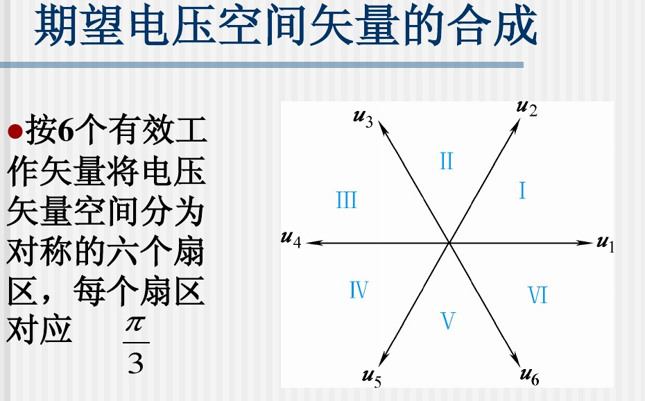
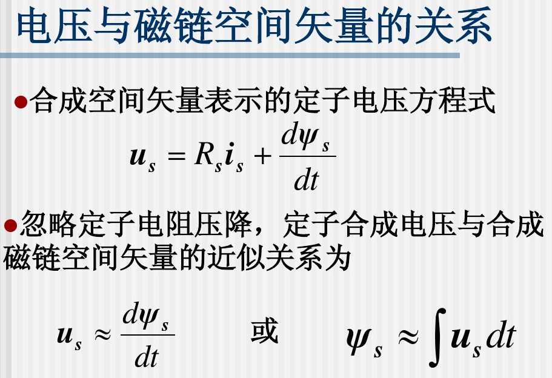

# 士兰微bldc学习
1. [IQ库学习](#iqmathlib)
1. [矢量合成学习(SVPWM)](#svpwm)
1. [函数分析](#funanalysis)
1. [linux文件系统与驱动](#fsdriver)
1. [devfs文件系统与驱动](#devfsdriver)
1. [sysfs文件系统和linux设备模型](#sysfsmode)
1. [udev的组成](#udevmakeof)
1. [udev规制文件](#udevrule)
## [IQ库学习](#TOCID)
1. [IQ库英文文档](pic/04IQ_math_lib.pdf),文件路径：pic/04IQ_math_lib.pdf
1. [IQ库中文文档](pic/04IQmath中文手册.pdf),文件路径：pic/04IQmath中文手册.pdf
1. [Sin_Table](https://www.mymathtables.com/trigonometric/cotangents-0to90-tables.html),文件路径：https://www.mymathtables.com/trigonometric/cotangents-0to90-tables.html
## [矢量合成学习(SVPWM)](#TOCID)
|电压|开关SA|开关SB|开关SC|UA|UB|UC|合成US|
|:-|:-|:-|:-|:-|:-|:-|:-|:-|
|$u_0$|0|0|0|$-\frac{U_d}{2}$|$-\frac{U_d}{2}$|$-\frac{U_d}{2}$|0|
|$u_1$|1|0|0|$\frac{U_d}{2}$|$-\frac{U_d}{2}$|$-\frac{U_d}{2}$|$\sqrt{\frac{2}{3}}$Ud|
|$u_2$|1|1|0|$\frac{U_d}{2}$|$\frac{U_d}{2}$|$-\frac{U_d}{2}$|$\sqrt{\frac{2}{3}}$Ud ej$\frac{\pi}{3}$|
|$u_3$|0|1|0|$-\frac{U_d}{2}$|$\frac{U_d}{2}$|$-\frac{U_d}{2}$|$\sqrt{\frac{2}{3}}$Ud ej$\frac{2\pi}{3}$|
|$u_4$|0|1|1|$-\frac{U_d}{2}$|$\frac{U_d}{2}$|$\frac{U_d}{2}$|$\sqrt{\frac{2}{3}}$Ud ej$\frac{3\pi}{3}$|
|$u_5$|0|0|1|$-\frac{U_d}{2}$|$-\frac{U_d}{2}$|$\frac{U_d}{2}$|$\sqrt{\frac{2}{3}}$Ud ej$\frac{4\pi}{3}$|
|$u_6$|1|0|1|$\frac{U_d}{2}$|$-\frac{U_d}{2}$|$\frac{U_d}{2}$|$\sqrt{\frac{2}{3}}$Ud ej$\frac{5\pi}{3}$|
|$u_7$|1|1|1|$\frac{U_d}{2}$|$\frac{U_d}{2}$|$\frac{U_d}{2}$|0|

图3.png)

|扇区号|落在该扇区条件|变化成条件|$\alpha$条件|$\beta$条件|
|:-|:-|:-|:-|:-|
|扇区1|由$0°<\arctan{\frac{U_{\beta}}{U_{\alpha}}} <60°$， 得$U_{\alpha}>0$ ，$U_{\beta}>0$ 且 $\frac{U_{\beta}}{U_{\alpha}}<\sqrt{3}$ |$U_{\alpha}>0$  $U_{\beta}>0$ $\frac{\sqrt{3}}{2}U_{\alpha}-\frac{1}{2}U_{\beta}>0$|$U_{\beta}>0$ $\frac{\sqrt{3}}{2}U_{\alpha}+\frac{1}{2}U_{\beta}>0$ $\frac{\sqrt{3}}{2}U_{\alpha}-\frac{1}{2}U_{\beta}>0$|$U_{\beta}>0$ $\frac{\sqrt{3}}{2}U_{\alpha}+\frac{1}{2}U_{\beta}>0$ $(\frac{\sqrt{3}}{2}U_{\alpha}+\frac{1}{2}U_{\beta})-U_{\beta})>0$|
|扇区2|由$60°<\arctan{\frac{U_{\beta}}{U_{\alpha}}} <120°$， 得$U_{\beta}>0$ 且 $\frac{U_{\beta}}{\|U_{\alpha}\|}>\sqrt{3}$|$U_{\beta}>0$ $\frac{\sqrt{3}}{2}U_{\alpha}-\frac{1}{2}U_{\beta}<0$ $\frac{\sqrt{3}}{2}U_{\alpha}+\frac{1}{2}U_{\beta}>0$|$U_{\beta}>0$ $\frac{\sqrt{3}}{2}U_{\alpha}+\frac{1}{2}U_{\beta}>0$ $\frac{\sqrt{3}}{2}U_{\alpha}-\frac{1}{2}U_{\beta}<0$|$U_{\beta}>0$ $\frac{\sqrt{3}}{2}U_{\alpha}+\frac{1}{2}U_{\beta}>0$ $(\frac{\sqrt{3}}{2}U_{\alpha}+\frac{1}{2}U_{\beta})-U_{\beta})<0$|
|扇区3|由$120°<\arctan{\frac{U_{\beta}}{U_{\alpha}}} <180°$， 得$U_{\alpha}<0$ ，$U_{\beta}>0$ 且 $\frac{U_{\beta}}{-U_{\alpha}}<\sqrt{3}$|$U_{\alpha}<0$ $U_{\beta}>0$ $\frac{\sqrt{3}}{2}U_{\alpha}+\frac{1}{2}U_{\beta}<0$|$U_{\beta}>0$ $\frac{\sqrt{3}}{2}U_{\alpha}+\frac{1}{2}U_{\beta}<0$ $\frac{\sqrt{3}}{2}U_{\alpha}-\frac{1}{2}U_{\beta}<0$|$U_{\beta}>0$ $\frac{\sqrt{3}}{2}U_{\alpha}+\frac{1}{2}U_{\beta}<0$ $(\frac{\sqrt{3}}{2}U_{\alpha}+\frac{1}{2}U_{\beta})-U_{\beta})<0$|
|扇区4|由$180°<\arctan{\frac{U_{\beta}}{U_{\alpha}}} <240°$， 得$U_{\alpha}<0$ ，$U_{\beta}<0$ 且 $\frac{-U_{\beta}}{-U_{\alpha}}<\sqrt{3}$|$U_{\alpha}<0$ $U_{\beta}<0$ $\frac{\sqrt{3}}{2}U_{\alpha}-\frac{1}{2}U_{\beta}<0$|$U_{\beta}<0$ $\frac{\sqrt{3}}{2}U_{\alpha}+\frac{1}{2}U_{\beta}<0$ $\frac{\sqrt{3}}{2}U_{\alpha}-\frac{1}{2}U_{\beta}<0$|$U_{\beta}<0$ $\frac{\sqrt{3}}{2}U_{\alpha}+\frac{1}{2}U_{\beta}<0$ $(\frac{\sqrt{3}}{2}U_{\alpha}+\frac{1}{2}U_{\beta})-U_{\beta})<0$|
|扇区5|由$240°<\arctan{\frac{U_{\beta}}{U_{\alpha}}} <300°$， 得$U_{\beta}<0$ 且 $\frac{-U_{\beta}}{\|U_{\alpha}\|}>\sqrt{3}$|$U_{\beta}<0$ $\frac{\sqrt{3}}{2}U_{\alpha}-\frac{1}{2}U_{\beta}>0$ $\frac{\sqrt{3}}{2}U_{\alpha}+\frac{1}{2}U_{\beta}<0$|$U_{\beta}<0$ $\frac{\sqrt{3}}{2}U_{\alpha}+\frac{1}{2}U_{\beta}<0$ $\frac{\sqrt{3}}{2}U_{\alpha}-\frac{1}{2}U_{\beta}>0$|$U_{\beta}<0$ $\frac{\sqrt{3}}{2}U_{\alpha}+\frac{1}{2}U_{\beta}<0$ $(\frac{\sqrt{3}}{2}U_{\alpha}+\frac{1}{2}U_{\beta})-U_{\beta})>0$|
|扇区6|由$300°<\arctan{\frac{U_{\beta}}{U_{\alpha}}} <360°$， 得$U_{\alpha}>0$ ，$U_{\beta}<0$ 且 $\frac{-U_{\beta}}{U_{\alpha}}<\sqrt{3}$|$U_{\alpha}>0$  $U_{\beta}<0$ $\frac{\sqrt{3}}{2}U_{\alpha}+\frac{1}{2}U_{\beta}>0$|$U_{\beta}<0$ $\frac{\sqrt{3}}{2}U_{\alpha}+\frac{1}{2}U_{\beta}>0$ $\frac{\sqrt{3}}{2}U_{\alpha}-\frac{1}{2}U_{\beta}>0$|$U_{\beta}<0$ $\frac{\sqrt{3}}{2}U_{\alpha}+\frac{1}{2}U_{\beta}>0$ $(\frac{\sqrt{3}}{2}U_{\alpha}+\frac{1}{2}U_{\beta})-U_{\beta})>0$|

|$U_{\beta}>0$|$\frac{\sqrt{3}}{2}U_{\alpha}+\frac{1}{2}U_{\beta}>0$|$\frac{\sqrt{3}}{2}U_{\alpha}-\frac{1}{2}U_{\beta}>0$ $(\frac{\sqrt{3}}{2}U_{\alpha}+\frac{1}{2}U_{\beta})-U_{\beta}>0$|$\alpha$条件扇区号 $\beta$条件扇区号|
|:-:|:-:|:-:|:-:|
|A|B|C|N|
|1|1|1|扇区1|
|1|1|0|扇区2|
|1|0|0|扇区3|
|0|0|0|扇区4|
|0|0|1|扇区5|
|0|1|1|扇区6|
若把ABC的值按照3bit进行分配，则可以做如下等式判断$\alpha$条件$N=4C+2B+A$
|$\alpha$条件扇区|1|2|3|4|5|6|
|:-:|:-:|:-:|:-:|:-:|:-:|:-:|
|N|7|3|1|0|4|6|

若把按照代码进行分析则可以做如下等式判断
1. X = $U_{\beta}$
1. Y = $\frac{\sqrt{3}}{2}U_{\alpha}+\frac{1}{2}U_{\beta}$
1. Z = X - Y = $-\frac{\sqrt{3}}{2}U_{\alpha}+\frac{1}{2}U_{\beta}$
1. v->angle = (X > 0) + ((Y > X)<<1) + ((Z > X)<<2)
   
|$U_{\beta}>0$|$\frac{\sqrt{3}}{2}U_{\alpha}+\frac{1}{2}U_{\beta}>U_{\beta}$ $\frac{\sqrt{3}}{2}U_{\alpha}-\frac{1}{2}U_{\beta}>0$|$-\frac{\sqrt{3}}{2}U_{\alpha}+\frac{1}{2}U_{\beta}>U_{\beta}$ $\frac{\sqrt{3}}{2}U_{\alpha}+\frac{1}{2}U_{\beta}<0$|代码扇区号|
|:-:|:-:|:-:|:-:|
|A|B|C|N|
|1|1|0|扇区1|
|1|0|0|扇区2|
|1|0|1|扇区3|
|0|0|1|扇区4|
|0|1|1|扇区5|
|0|1|0|扇区6|
若把ABC的值按照3bit进行分配，则可以做如下等式判断$\beta$条件$N=4C+2B+A$
|代码条件扇区|1|2|3|4|5|6|
|:-:|:-:|:-:|:-:|:-:|:-:|:-:|
|N|3|1|5|4|6|2|

## [函数分析](#TOCID)
|函数|功能分析描述|
|:-|:-|
|svpwmGen()|逆变波形svpwm产生 1. 通过 Ualpha 和 Ubeta 确定当前的实时扇区 2.通过表确定扇区所在位置 |
|||