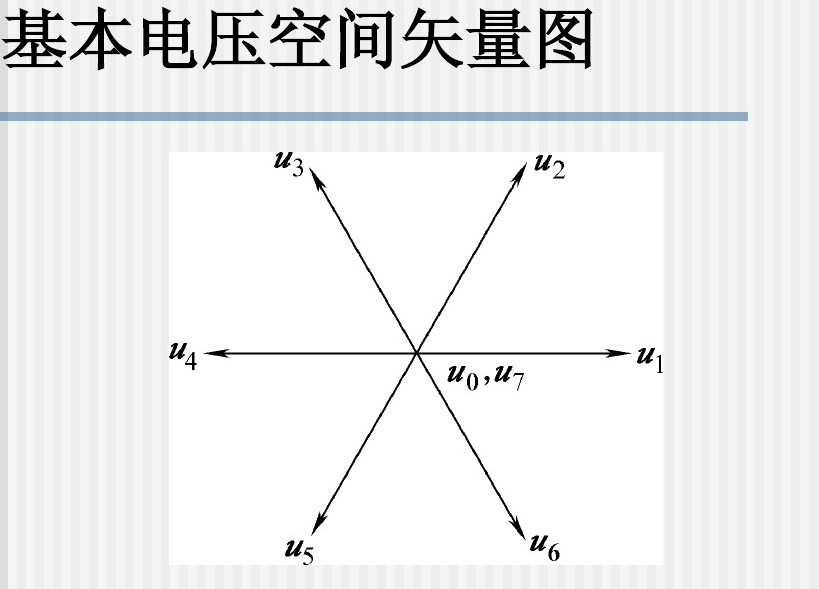

# 士兰微bldc学习
1. [IQ库学习](#iqmathlib)
1. [矢量合成学习(SVPWM)](#svpwm)
1. [函数分析](#funanalysis)
1. [linux文件系统与驱动](#fsdriver)
1. [devfs文件系统与驱动](#devfsdriver)
1. [sysfs文件系统和linux设备模型](#sysfsmode)
1. [udev的组成](#udevmakeof)
1. [udev规制文件](#udevrule)
## [IQ库学习](#TOCID)
1. [IQ库英文文档](pic/04IQ_math_lib.pdf),文件路径：pic/04IQ_math_lib.pdf
1. [IQ库中文文档](pic/04IQmath中文手册.pdf),文件路径：pic/04IQmath中文手册.pdf
1. [Sin_Table](https://www.mymathtables.com/trigonometric/cotangents-0to90-tables.html),文件路径：https://www.mymathtables.com/trigonometric/cotangents-0to90-tables.html
## [矢量合成学习(SVPWM)](#TOCID)

图3.png)
|电压|开关SA|开关SB|开关SC|UA|UB|UC|合成US|
|:-|:-|:-|:-|:-|:-|:-|:-|:-|
|U0|0|0|0|-Ud/2|-Ud/2|-Ud/2|0|
|U1|1|0|0|Ud/2|-Ud/2|-Ud/2|sqrt(2/3)Ud|
|U2|1|1|0|Ud/2|Ud/2|-Ud/2|sqrt(2/3)Ud ej*pi/3|
|U3|0|1|0|-Ud/2|Ud/2|-Ud/2|sqrt(2/3)Ud ej*2pi/3|
|U4|0|1|1|-Ud/2|Ud/2|Ud/2|sqrt(2/3)Ud ej*pi|
|U5|0|0|1|-Ud/2|-Ud/2|Ud/2|sqrt(2/3)Ud ej*4pi/3|
|U6|1|0|1|Ud/2|-Ud/2|Ud/2|sqrt(2/3)Ud ej*5pi/3|
|U7|1|1|1|Ud/2|Ud/2|Ud/2|0|
## [函数分析](#TOCID)
|函数|功能分析描述|
|:-|:-|
|svpwmGen()|逆变波形svpwm产生 1. 通过 Ualpha 和 Ubeta 确定当前的实时扇区 2.通过表确定扇区所在位置 |
|||