# git学习<span id="TOCID"></span>
1. [git软件安装](#install)
1. [TortoiseGit使用](#TortoiseGituse)
   1. [使用TortoiseGit创建本地仓库](#TortoiseGitCreate)
   1. [使用TortoiseGit把修改内容加入缓存](#TortoiseGitAdd)
   1. [使用TortoiseGit把缓存加入仓库](#TortoiseGitCommit)
   1. [使用TortoiseGit版本比较](#TortoiseGitCompare)
   1. [使用TortoiseGit版本回退](#TortoiseGitReset)
   1. [使用TortoiseGit版本分支](#TortoiseGitBranch)
   1. [使用TortoiseGit版本打包](#TortoiseGitTag)
1. [gitignore文件使用](#gitignore)
   1. [忽略文件](#ignorefile)
   2. [忽略文件夹](#ignoredir)
1. [git终端使用](#git)
   1. [使用终端创建本地仓库](#GitCreate)
   1. [使用终端把修改内容加入缓存](#GitAdd)
   1. [使用终端把缓存加入仓库](#GitCommit)
   1. [使用终端版本比较](#GitCompare)
   1. [使用终端版本回退](#GitReset)
   1. [使用终端版本分支](#GitBranch)
   1. [使用终端版本打包](#GitTag)
   1. [使用终端切换](#GitCheck)
   1. [使用终端显示日志](#GitLog)
   1. [使用终端显示操作日志](#GitReflog)
**只是本地管理，不包含pull等，远程操作**
## <span id="install"></span>[git软件安装](#TOCID)
> 软件安装部分主要是按照三个软件，不详细说，熟悉终端操作的同事可以只安装git软件，而不需要安装tortoisegit及其中文语言包，后者只是为了方便不熟悉终端操作，同时又曾经使用过tortoisesvn的同事，因为其代码管理和svn类似。
> 软件[Git-2.19.0-64-bit.exe](https://git-scm.com/download)是主要的git管理软件，它支持终端操作和简单的gui操作，适合熟悉终端操作的同事，作为本地或远程代码管理
> 软件[TortoiseGit-2.8.0.0-64bit.msi](https://tortoisegit.org/download/)是TortoiseGit的软件安装包，TortoiseGit的操作和TortoiseSvn类似，方便熟悉TortoiseSvn的同事快速上手。
> 软件[TortoiseGit-LanguagePack-2.8.0.0-64bit-zh_CN.msi](https://tortoisegit.org/download/)是TortoiseGit的语言包，默认支持语言是英文，不习惯的同事，可以安装相应的语言包。

## <span id="TortoiseGituse"></span>[TortoiseGit使用](#TOCID)
1. 使用TortoiseGit创建本地仓库<span id="TortoiseGitCreate"></span>
	> 1、我们首先新进一个文件夹，作为仓库的根目录，这里命名为testtortoisegit
	2、在文件目录下，右键选择如下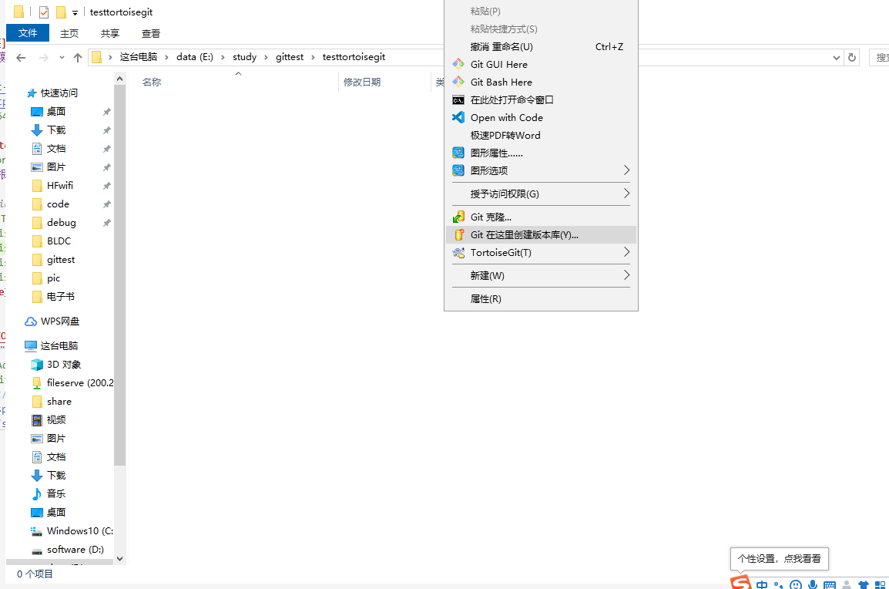
    3、创建成功之后，目录testtortoisegit会出现一个名为.git的文件夹 
    **.git文件夹是核心，只要它存在就可以恢复回之前commit过的任意一个版本**
2. 使用TortoiseGit把修改内容加入缓存<span id="TortoiseGitAdd"></span>
   1. 我们首先建立两个测试文件a.c和a.h，并在里面输入this is c/h file
   2. 右键按照如下图所示的选择路径(Tortoisegit->显示日志)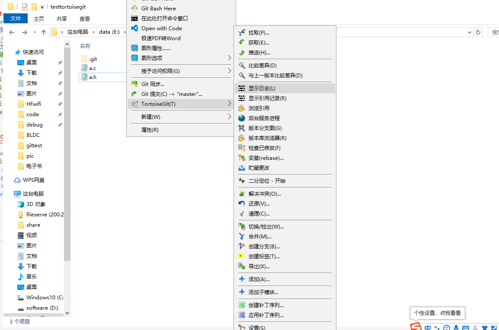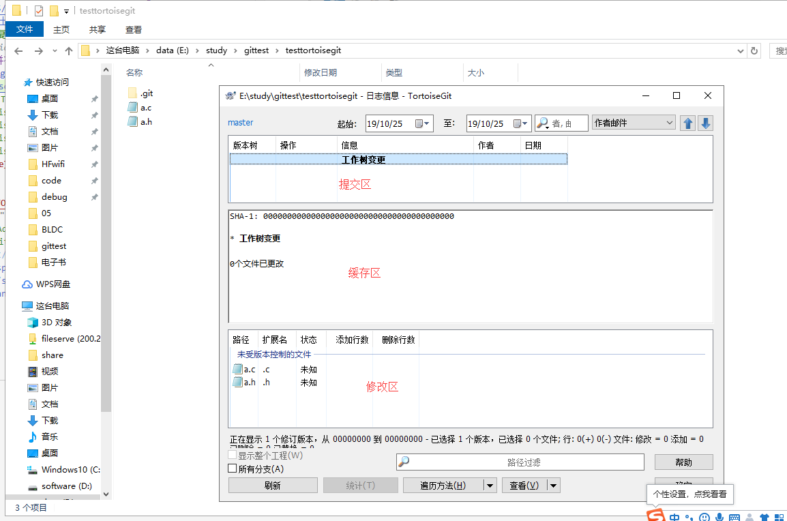
   3. 上图分为三个区，
    > 修改区，我们实时更新修改的工作区
    缓存区，相当于提交成最终版本前的一个备份区
    提交区，这是我们最终提交到本地仓库的记录版本，可以在任意时候回退查看
    4. 我们按照如下步骤把当前的修改区内容添加到缓存区中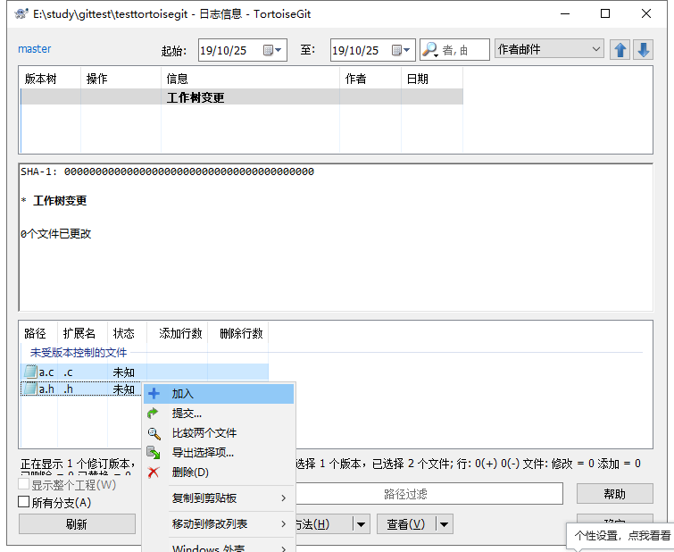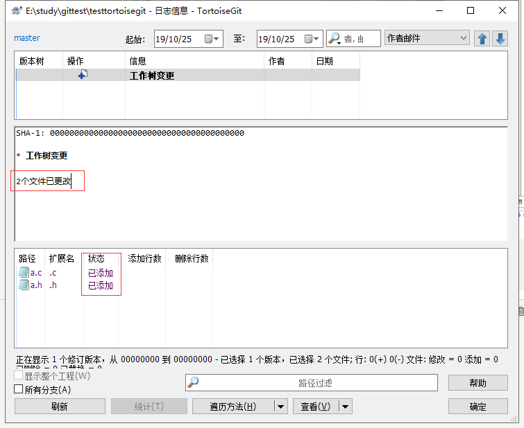
    5. 当加入文件成功后，文件的状态从未知变为已添加，且缓存区显示两个文件已更改，此时加入缓存成功。
3. 使用TortoiseGit把缓存加入仓库<span id="TortoiseGitCommit"></span>
   1. 按照下图步骤把缓存区的文件提交到仓库 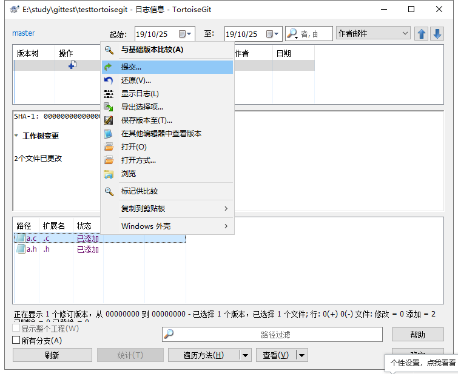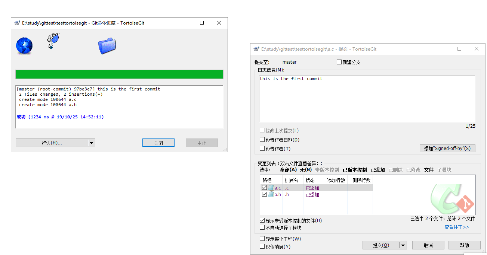
   2. 输入提交信息（比如这里输入了this is the first commit），并提交，成功后如上图显示，显示成功后点击关闭
   3. 到主界面刷新后显示如下，显示提交信息，和变更文件 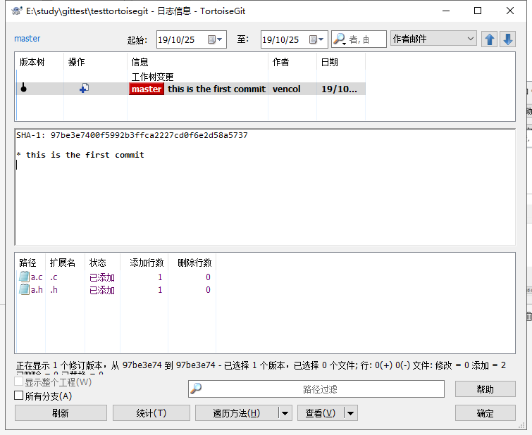
4. 使用TortoiseGit版本比较<span id="TortoiseGitCompare"></span>
   1. 修改a.c文件，修改完后如下显示 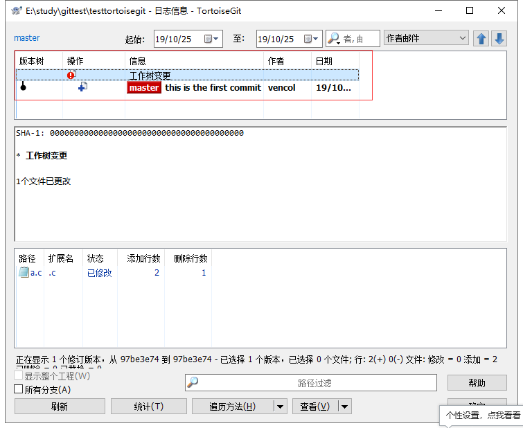
   2. 可以看出a.c文件已修改，这里我们双击a.c文件，显示出比较文件如下 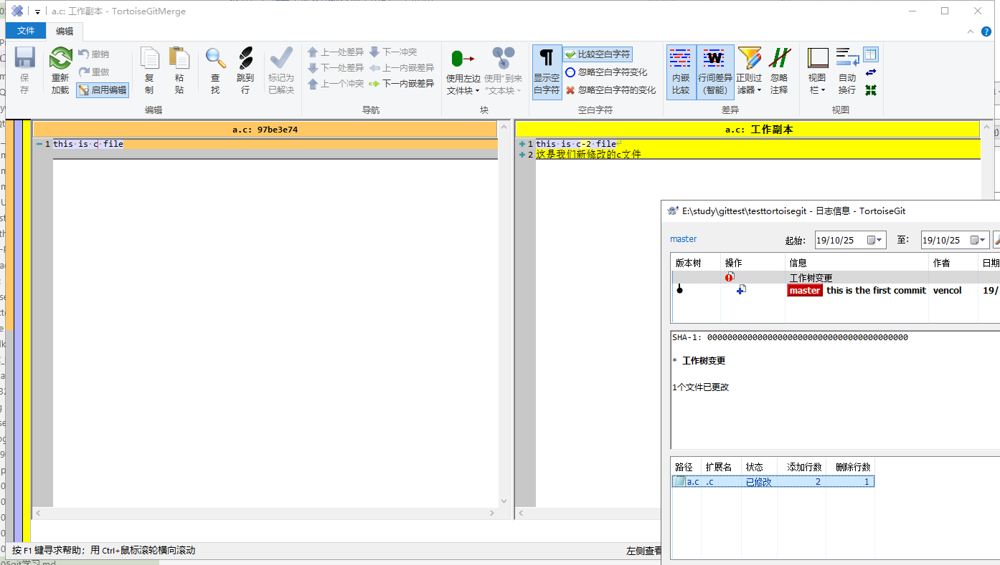
   3. 可以看出我们a.c文件前后被修改的内容
   4. 我们先把a.c的修改提交到缓存区  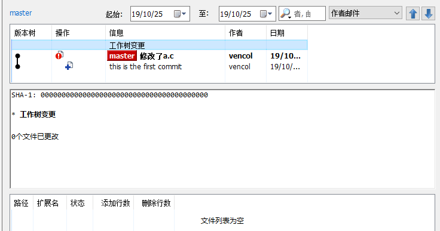
   5. 我们拷贝两个文件过来工作区 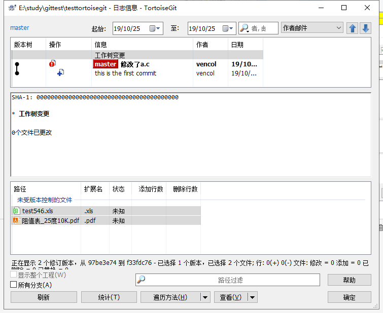
   6. 可以看出新增加了两个文件，把他们加入缓存并提交 
5. 使用TortoiseGit版本回退<span id="TortoiseGitReset"></span>
   1. 现有版本如下，有三个版本 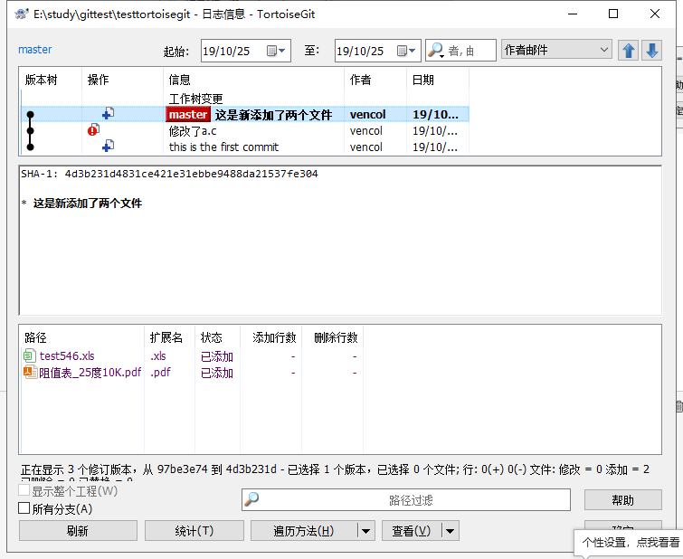
   2. 现在我们回退到第一个版本this is the first commit 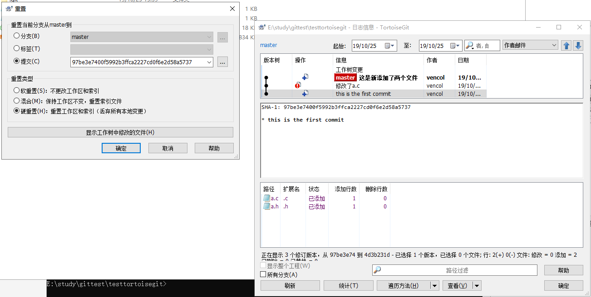
   3. 重置后，目录中的新增及修改部分直接回滚到第一个版本
   **一般建议使用分支功能，重置后也可以切换到不同分支**
6. 使用TortoiseGit版本分支<span id="TortoiseGitBranch"></span>
   分支功能比较强大，感觉有点像平行时空的不同仓库，仓库之间互不影响，但是又可以通过不同分支进行合并（**合并功能自行熟悉**），
   可以做版本分支、也可以做新修改分支、或者以某个版本作为分支
   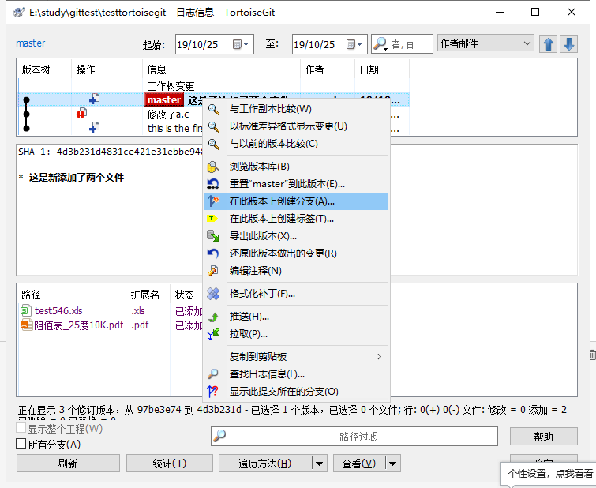
7. 使用TortoiseGit版本打包<span id="TortoiseGitTag"></span>
   打包的功能，可以理解为特殊的分支，主要用于管理发布的程序
   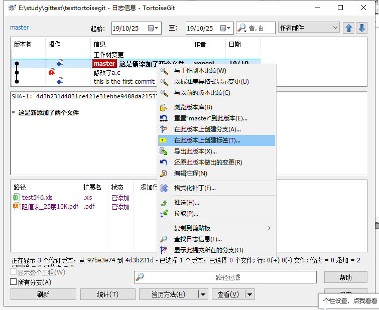
   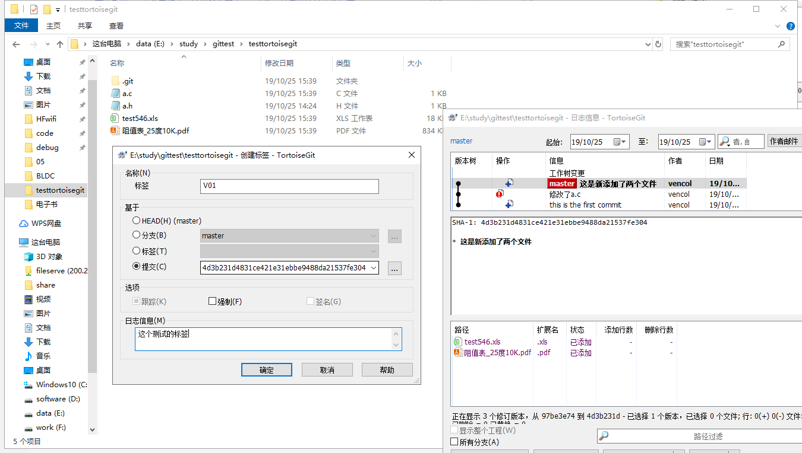

## <span id="gitignore"></span>[gitignore文件使用](#TOCID)
.gitignore文件在git管理中试用来过滤文件的
1. 忽略文件<span id="ignorefile"></span>
   1. 在.gitignore文件中添加我们需要过滤的文件，支持通配符
        1. a.c过滤特定的a.c文件
        2. *.c过滤所有c文件
        3. a?.c过滤 a+“一个字符”.c的文件
2. 忽略文件夹<span id="ignoredir"></span>
        1. a/*忽略a文件夹下的所有文件，包括文件夹
        2. a/b忽略a/b下的b文件夹及其内容
3. 不忽略<span id="ignoredir"></span>
        1.同层文件不忽略，直接使用!a.c，不忽略a.c文件
        2.当a/b文件夹被过滤了，需要不过滤a/b/a.c文件，则要 “a/b/*  !a/b/a.c ”
       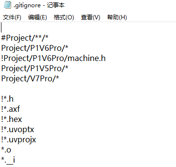
        
## <span id="git"></span>[git终端使用](#TOCID)
使用终端主要是为了方便linux开发的同事，用终端操作可以有更大的自由度，可以使用help
1. 使用终端创建本地仓库<span id="GitCreate"></span>
   > 使用```git init```进行本地仓库的初始化
2. 使用终端把修改内容加入缓存<span id="GitAdd"></span>
   > 使用```git add .```把所有文件加入到本地缓存区
   > 使用```git add a.c```把a.c文件加入到本地缓存区
3. 使用终端把缓存加入仓库<span id="GitCommit"></span>
   > 使用```git commit -a```把缓存区内容提交到仓库版本
4. 使用终端版本比较<span id="GitCompare"></span>
   > 使用```git diff .```列出当前所有文件修改
   > 使用```git diff a.c```列出a.c文件修改
5. 使用终端版本回退<span id="GitReset"></span>
   > 使用```git reset --hard  hashid```回退到hashid的版本，hashid可从log日志中获取
6. 使用终端版本分支<span id="GitBranch"></span>
   > 使用```git branch -a```列出所有的分支信息
   > 使用```git branch branchname```新建branchname分支
   > 使用```git branch -d branchname```删除branchname分支信息
7. 使用终端版本打包<span id="GitTag"></span>
   > 使用```git tag -l ```列出所有的打包版本信息
   > 使用```git tag -l 1.*.*```列出所有的1.*.*的打包版本信息
   > 使用```git tag -a version -m information ```打包当前工作区为版本version，注释信息为information
   > 使用```git tag -a version hashid -m information ```打包工作区id为hashid的工作区为版本version，注释信息为information
7. 使用终端切换<span id="GitCheckout"></span>
   > 使用```git checkout . ```放弃当前工作区的修改
   > 使用```git checkout hashid ```切换到特定的hashid工作区
   > 使用```git checkout branchname ```切换到特定的branchname工作区
   > 使用```git checkout tagname ```切换到特定的tagname工作区
8. 使用终端显示日志<span id="GitLog"></span>
   > 使用```git log ```显示当前工作区的提交记录
   > 使用```git log --graph```显示当前工作区的提交记录的图形线索
   > 使用```git log -p a.c```显示当前工作区与a.c文件相关的提交记录
9.  使用终端显示操作日志<span id="GitReflog"></span>
   > 使用```git reflog ```显示当前工作区的提交记录